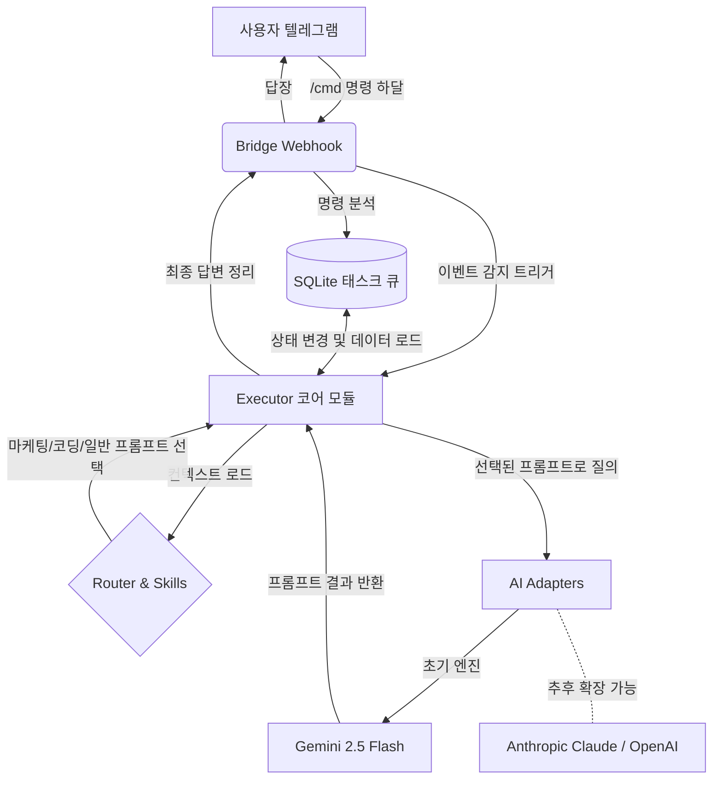

# 아키텍처 v2.0: MyCrew 독자 엔진 (Gemini AI + 어댑터)

## 📌 설계 배경 (Background)
MyCrew v1.5 프로젝트에서 도입을 고려했던 **페이퍼클립 로컬 엔진**은 API 샌드박싱과 폐쇄적인 프론트엔드-백엔드 구조로 인해 브릿지 서버(Telegram)와의 완벽한 양방향 통신에 치명적인 한계를 드러냈습니다.

따라서 페이퍼클립의 거대 시스템(PostgreSQL + Next.js UI)에 대한 의존도를 과감히 버리고, 페이퍼클립의 핵심 장점인 **"Context + Skill + LLM" 메커니즘을 벤치마킹하여 자체 Node.js 엔진(브릿지 서버 내재화)으로 완전히 리빌딩**하는 아키텍처 v2.0 로의 전환을 선언합니다.

---

## 🛠️ 핵심 변경 및 시스템 모식도

v2.0 아키텍처는 **브릿지 서버(Bridge Server)** 단일 애플리케이션 안에서 텔레그램 메신저 수신, 태스크 큐 적재, 그리고 **AI 어댑터를 통한 업무 처리까지 모두 수행**하는 **단독 о케스트레이션 엔진**으로 구성되어 있습니다.

---

## 💾 세부 컴포넌트 (Components)

### 1. Database 레이어 (`database.js`)
기존 페이퍼클립의 무거운 DB를 대체하는 **초경량 SQLite** 기반의 자체 시스템입니다.
* **파일**: `database.sqlite`
* **주요 테이블**: `Task`
* **구조**: `ID`, `content`(명령 내용), `status`(PENDING, COMPLETED), `requester`(지시자), `model`(실행에 사용된 모델)
* **목적**: 텔레그램 명령 유실 방지 및 다수 명령 적재

### 2. AI Engine 레이어 (`ai-engine/`)
외부에서 제공되는 AI 엔진(페이퍼클립)을 대체하는 핵심 두뇌 모듈 그룹입니다.

#### A. Router (`router.js`)
텔레그램을 통해 들어온 태스크를 분석(향후 NLP 도입 가능)하여, **최적의 시스템 프롬프트(스킬)를 선택**하고 할당합니다.

#### B. Skills (`skills/generalSkill.js` 등)
페이퍼클립의 `.md` 스킬들을 분석해 Javascript 객체 모델로 재해석했습니다.
* **형태**: 특정 페르소나, 목표, 출력 포맷을 통제하는 시스템 프롬프트 반환 모듈.
* 대표님의 지시(Context)와 결합하여 정교한 결과물을 낼 수 있도록 하는 영혼의 집합소입니다.

#### C. Adapters (`adapters/geminiAdapter.js`)
가장 중요한 **"모델 애그노스틱(Model-Agnostic)"** 어댑터 패턴입니다. 
AI 오케스트레이션의 종속성을 제거하기 위해, 구글의 제미나이(Gemini 2.5 Flash) 등 다양한 LLM을 마치 레고 블록처럼 갈아 끼울 수 있는 규격입니다. 현재는 속도와 성능이 압도적인 **Gemini API**가 기본 모듈로 탑재되었습니다.

#### D. Executor (`executor.js`)
- 스킬(Router 선택)과 텔레그램 요청 내용(명령)을 묶습니다.
- 선택된 어댑터(GeminiAdapter)를 향해 발사합니다.
- 도출된 결과값을 브릿지 서버(Telegram) 쪽으로 돌려줍니다.

---

## 🌟 기대 효과 (Next Steps)
1. **완벽한 통제권**: 남의 DB 눈치를 보지 않으며, 모든 라우팅과 프롬프트 수정이 `ai-engine` 폴더 내에서 1초 만에 이루어집니다.
2. **유연한 모델 확장성**: Claude/GPT 연결이 필요하면 새로운 Adapter 파일 하나만 만들면 됩니다.
3. **텔레그램 지향 설계**: 철저히 모바일 메신저를 통해 지시를 내리고 피드백을 받는 UX 기반으로 스킬들이 진화하게 됩니다.
