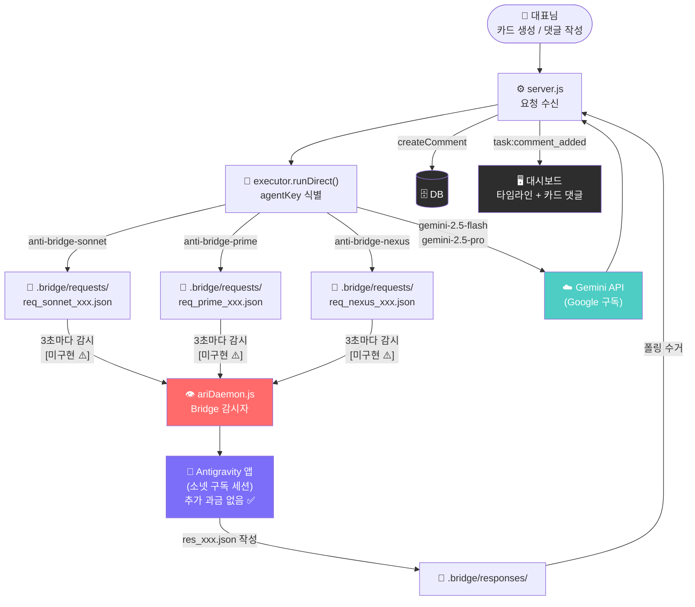
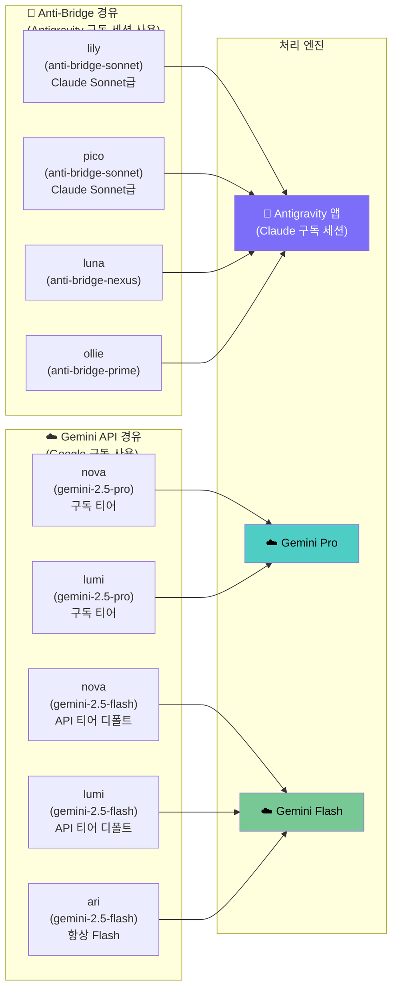

# Anti-Bridge 아키텍처 — 완전 해설 및 구현 현황
**작성일**: 2026-04-25  
**중요도**: 🔴 최상위 — 과금 모델 및 핵심 아키텍처 관련

---

## 1. 왜 이 구조가 존재하는가 — 핵심 철학

> "MyCrew 사용자는 이미 Antigravity 구독을 지불했다.  
> AI 크루가 작업할 때 **추가 API 비용이 발생해서는 안 된다.**"

이것이 Anti-Bridge의 존재 이유입니다.

일반적인 AI 서비스와 비교:

```
[일반 AI 서비스]
사용자 → 서버 → Claude/Gemini API 직접 호출 → 💸 사용량 과금 발생

[MyCrew Anti-Bridge 설계]
사용자 → 서버 → .bridge 파일 채널 → Antigravity 앱(이미 구독 완료) → 💰 추가 비용 없음
```

---

## 2. Anti-Bridge 구조 전체 다이어그램



> [!WARNING]
> **`ariDaemon.js` Bridge 감시 코드 미구현** (2026-04-25 기준)  
> 현재 anti-bridge-* 요청은 5분 대기 후 Gemini Flash Fallback으로 처리됩니다.

---

## 3. 식별자 체계 — 어떤 크루가 어디로 라우팅되는가



> **분기 조건**: 서버 환경변수 `USER_MODEL_TIER=pro` 설정 시 nova/lumi → Gemini Pro 격상  
> 미설정(디폴트) 또는 API 사용자 → Gemini Flash 유지

### agentKey 추출 규칙

```javascript
// antigravityAdapter.js 내부
const agentKey = modelName.replace('anti-bridge-', '');
// 'anti-bridge-prime' → 'prime'  ✅
// 'anti-bridge-nexus' → 'nexus'  ✅
// 'claude-sonnet-4-6' → 'claude-sonnet-4-6'  ❌ (잘못된 식별자)
```

---

## 4. 현재 구현 현황 및 버그 기록

### ✅ 구현 완료

| 컴포넌트 | 파일 | 상태 |
|---------|------|------|
| 브릿지 요청 파일 작성 | `antigravityAdapter.js` | ✅ 완료 |
| 응답 파일 폴링 (3초 간격) | `antigravityAdapter.js` | ✅ 완료 |
| 타임아웃 시 Gemini Fallback | `antigravityAdapter.js` | ✅ 완료 |
| 식별자 체계 (SSOT) | `modelRegistry.js` | ✅ 완료 |
| executor에서 anti-bridge-* 라우팅 | `executor.js` | ✅ 완료 |

### ❌ 미구현 / 버그

| 항목 | 파일 | 설명 |
|------|------|------|
| **Bridge 감시 데몬** | `ariDaemon.js` | `.bridge/requests/` 폴더 모니터링 코드 **없음** → 5분 대기 후 항상 Gemini Fallback |
| ~~lily/pico 식별자 오류~~ | ~~`executor.js`~~ | ~~MODEL.SONNET → claude-sonnet-4-6 (Anti-Bridge 형식 아님)~~ **2026-04-25 수정 완료** |
| ~~claude-* 잘못된 라우팅~~ | ~~`executor.js`~~ | ~~claude-* → antigravityAdapter 오라우팅~~ **2026-04-25 수정 완료** |

---

## 5. 오류 분석 — 왜 lily가 에러 응답을 반환했나

```
[2026-04-25 발생한 오류 시나리오]

1. lily 카드에 댓글 작성
2. server.js → executor.runDirect(content, 'lily', taskId)
3. AGENT_SIGNATURE_MODELS['lily'] = MODEL.SONNET = 'claude-sonnet-4-6'  ← 잘못된 식별자
4. runDirect() → 'claude-*' 체크 → antigravityAdapter 호출
5. antigravityAdapter 내부: agentKey = 'claude-sonnet-4-6' (prefix 제거 안 됨)
6. 파일 작성: req_claude-sonnet-4-6_xxx.json  ← 아무도 감시 안 하는 파일 이름
7. 5분 대기... (타임아웃)
8. Gemini Flash Fallback 실행
9. 응답 수신 → createComment()
→ 실제로 보인 답: "[QUICK_CHAT] 모듈 로드 완료. claude-sonnet-4-6으로 생성을 시작합니다..."

(이 로그는 runDirect()의 broadcastLog가 타임라인에 표시된 것)
```

---

## 6. 수정 이력 (2026-04-25)

### Fix A: lily/pico 식별자 교정
```javascript
// executor.js AGENT_SIGNATURE_MODELS
// Before (오류):
'lily': MODEL.SONNET,  // 'claude-sonnet-4-6' — Anti-Bridge 형식 아님
'pico': MODEL.SONNET,

// After (수정):
'lily': MODEL.ANTIGRAVITY_PRIME,  // 'anti-bridge-prime' ✅
'pico': MODEL.ANTIGRAVITY_PRIME,  // 'anti-bridge-prime' ✅
```

### Fix B: 잘못된 claude-* 라우팅 롤백
```javascript
// executor.js runDirect()
// Before (오류 - 소넷이 실수로 추가):
if (modelToUse.startsWith('anti-bridge-') || modelToUse.startsWith('claude-')) {
  → antigravityAdapter  // claude-* 모델이 잘못된 agentKey로 5분 대기

// After (수정):
if (modelToUse.startsWith('anti-bridge-')) {
  → antigravityAdapter  // 오직 Anti-Bridge 식별자만
```

---

## 7. 남은 핵심 작업 — ariDaemon Bridge 감시 구현

Anti-Bridge가 완전히 동작하려면 `ariDaemon.js`에 아래 로직이 필요합니다:

```javascript
// ariDaemon.js에 추가 필요
const BRIDGE_REQ_DIR = path.resolve(process.cwd(), '.bridge/requests');
const BRIDGE_RES_DIR = path.resolve(process.cwd(), '.bridge/responses');

async function processBridgeRequests() {
  const files = fs.readdirSync(BRIDGE_REQ_DIR).filter(f => f.endsWith('.json'));
  
  for (const file of files) {
    const reqPath = path.join(BRIDGE_REQ_DIR, file);
    const request = JSON.parse(fs.readFileSync(reqPath, 'utf-8'));
    
    // Antigravity 세션(Gemini)으로 처리
    const response = await ai.generateContent(/* 요청 내용 */);
    
    // 응답 파일 작성
    const resFile = file.replace('req_', 'res_');
    fs.writeFileSync(path.join(BRIDGE_RES_DIR, resFile), JSON.stringify({ text: response }));
    
    // 요청 파일 삭제
    fs.unlinkSync(reqPath);
  }
}

// 3초마다 폴링
setInterval(processBridgeRequests, 3000);
```

---

## 8. 비용 구조 정리

| 크루 | 식별자 | 처리 엔진 | 추가 비용 |
|------|--------|---------|----------|
| lily, pico | anti-bridge-sonnet | Antigravity 앱 (구독) | ✅ 없음 |
| luna, ollie | anti-bridge-nexus/prime | Antigravity 앱 (구독) | ✅ 없음 |
| nova, lumi | gemini-2.5-pro (구독 티어) | Gemini Pro | ✅ 없음 |
| nova, lumi | gemini-2.5-flash (API 티어, 디폴트) | Gemini Flash | ✅ 없음 |
| ari | gemini-2.5-flash (항상) | Gemini Flash | ✅ 없음 |
| ~~claude-sonnet-4-6 직접 호출~~ | ~~직접 API~~ | ~~Anthropic API~~ | ❌ **추가 과금** — 사용 금지 |

> [!IMPORTANT]
> MyCrew는 구독 기반 서비스입니다. `claude-*`, `gemini-*` 등 직접 API 식별자를  
> AGENT_SIGNATURE_MODELS에 사용하면 예상치 못한 과금이 발생합니다.  
> 반드시 `anti-bridge-*` 또는 Gemini Flash(구독 포함) 식별자만 사용하세요.
