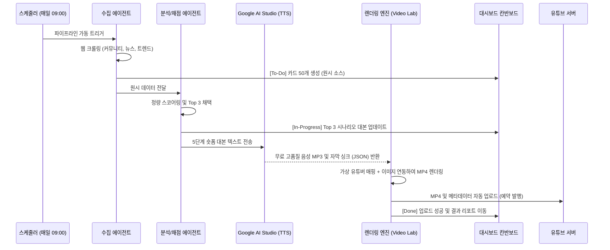

# Phase 24: MyCrew 멀티 에이전트 기반 무인(Faceless) 유튜브 채널 100% 자동화 구축 PRD

## 1. 프로젝트 개요 (Overview)
기존 비디오랩의 "수동 개입형(Human-in-the-loop)" 영상 제작 워크플로우를 넘어서, **사람의 개입이 단 1%도 없는 "Zero-Touch 무인 유튜브 공장"**을 구축합니다. 
두 개의 독립된 AI 에이전트(수집, 분석)가 매일 자율적으로 트렌드를 서치하고 스크립트를 확정하면, 백엔드 렌더링 엔진(Remotion)과 유튜브 API가 결합하여 영상을 발행합니다.

### 🔄 제로터치 워크플로우 다이어그램

## 2. 아키텍처 및 다중 에이전트 (Agents & Pipeline)

### [에이전트 1] 정보 수집 담당 (Data Harvester)
- **역할:** 특정 채널(예: 금융/주식, AI 꿀팁 등)의 도메인에 맞춰 웹 크롤링 및 소셜 모니터링 수행
- **실행 주기:** 크론잡(Cron) 기반 매일 정해진 시각(예: 오전 6시, 낮 12시)에 2회 가동
- **수집 소스:** 
  - 국내/해외 주요 커뮤니티 (레딧, 블라인드, 디시인사이드 등)
  - 뉴스 사이트, 트위터 트렌드, 최신 유튜브 인기 동영상 목록 등
- **산출물:** 원시 데이터셋 (Raw Source DB) - 링크, 원문 텍스트, 조회수, 댓글 수, 게재 시간 등

### [에이전트 2] 분석 및 채택 담당 (Curation & Scripting Director)
- **역할:** 수집된 원시 데이터들 중 쓰레기를 걸러내고 "가장 바이럴 확률이 높은" 소스를 선별 및 스크립트화
- **정량적 채택 알고리즘 (Scoring System):**
  - ① 정보의 신선도 (Freshness): 24시간 이내의 폭발적 이슈인가? (가중치 30%)
  - ② 관심도 폭발 (Engagement): 댓글 수 대비 조회수, 혹은 추천 비율이 높은가? (가중치 40%)
  - ③ 포맷 적합도 (Format Fit): 방금 구축한 `split-impact` 레이아웃(문제-해결구조) 5단계에 딱 들어맞는 자극적인 구조인가? (가중치 30%)
- **프로세스:**
  1. 수집된 수백 개의 소스 중 스코어 최상위 3개 채택 (Daily Top 3)
  2. 각각을 5단계 쇼츠 대본(Hook -> Problem -> Proof -> Climax -> CTA) 구조로 변환
- **산출물:** 최종 렌더링 대기용 JSON 파일 (Remotion Props 포맷)

### [파이프라인] 렌더링 및 메타 발행 (Render & Publish)
- **역할:** 에이전트 2가 떨어뜨린 시나리오를 바탕으로 물리적 MP4 파일을 구워낸 후 업로드
- **프로세스:**
  1. **이미지 랩(FLUX) 연동:** 시나리오 씬에 쓰일 컨셉 이미지 자동 생성
  2. **오디오 및 자막 싱크(Audio & Sync):** Google AI Studio의 무료 TTS 엔진을 활용하여 고품질 성우 목소리(MP3) 추출 및 음절 단위 자막 타임프레임(Sync JSON) 매핑
  3. **모션 렌더링(Remotion):** VTuber 오퍼레이터(PICO, ARI 등) 및 자막 애니메이션 매핑 후 MP4 컴파일
  4. **Auto-Upload (YouTube Data API):** 완성된 MP4를 제목, 해시태그와 함께 지정된 채널에 발행.

## 3. 기술적 구현 방안 (Tech Stack)

### A. 크롤링 및 에이전트 엔진
- **Puppeteer / API:** 레딧, 트위터, 네이버 뉴스 등은 텍스트 API 또는 Puppeteer 기반 봇으로 스크레이핑
- **아리(Ari) 백엔드 데몬:** 백그라운드 프로세스로 24시간 대기하며 에이전트 1, 2의 Task Queue(큐)를 관리.

### B. 유튜브 Data API v3 연동
- 구글 클라우드 콘솔에서 "YouTube Data API v3" 권한 획득.
- `google-apis-nodejs-client`를 활용하여 `Videos: insert` 메서드로 로컬의 `.mp4` 파일을 직접 푸시.
- 에이전트가 영상 제목 세팅 시 "가장 후킹한 캡션 내용"을 유튜브 쇼츠 제목으로 자동 입력.

## 4. 로드맵: 최적화 및 고도화 (Phase 2 Iteration)

1. **시청자 반응(Analytics) 자가 학습:**
   - 유튜브 업로드 후 3일 뒤, 유튜브 Analytics API를 통해 조회수와 시청 지속 시간(Retention) 스코어를 가져옴.
   - 이 데이터를 [에이전트 2]의 "포맷 적합도" 판단 로직에 피드백(Weight 조절)하여 갈수록 더 강력한 스크립트를 쓰도록 자체 파인튜닝.
2. **업로드 요일/시간대 자동 배치:**
   - 조회수가 가장 가파르게 오르는 황금 시간대(예: 퇴근길 18시, 취침 전 22시)를 스스로 분석.
   - 영상 3개를 뽑았으면, 무작정 지금 업로드하는 게 아니라 예약 발행 프레임워크 타임 슬롯에 맞춰 밀어 넣음.

## 5. 기대 효과 (Expected Impact)
대표는 더 이상 유튜브 채널 관리에 시간을 쏟지 않아도 됩니다. **마이크루의 전원이 켜져 있고 네트워크가 연결되어 있다면, 두 명의 가상 캐릭터(PICO, ARI)가 매일 각자의 채널에서 3개씩, 월 180개의 고품질 숏폼을 지치지 않고 찍어내어 유튜브 플랫폼의 알고리즘 파이를 영구적으로 잠식해 나가는 시스템**이 완성됩니다.
