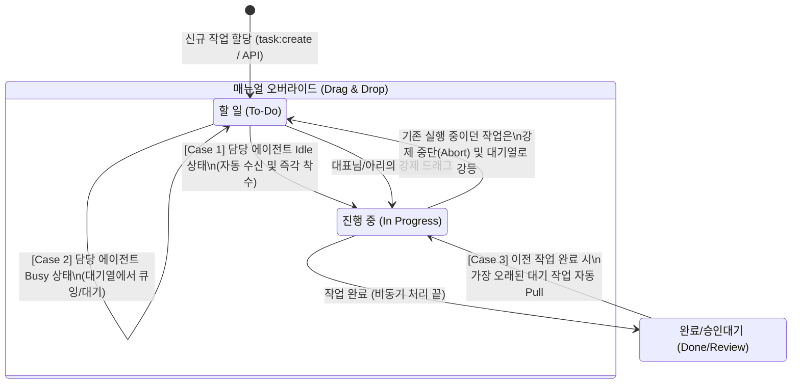

# MyCrew AI 에이전트 업무 처리 워크플로우 (Phase 25)

## 개요
아리 엔진(백엔드)의 칸반 기반 에이전트 작업 실행 방식이 폴링(Polling) 데몬 방식에서 **이벤트 기반(Event-Driven) Pull 모델 및 강제 인터럽트(Override) 모델**로 완전히 개편되었습니다. 이 문서는 모든 크루(Sonnet, Prime 등)가 공통으로 인지해야 할 시스템 동작 규격입니다.

## 업무 상태에 따른 경우의 수 다이어그램

## 핵심 동작 시나리오 상세

### 1. 자율 수신 (Auto-Pull)
- **트리거**: 
  - 신규 카드가 할당될 때 (`socket.on('task:create')` 또는 `POST /api/tasks/dispatch`)
  - 에이전트가 기존 작업을 완료하고 '진행'에서 벗어날 때
- **동작**: 시스템(Dispatcher)이 해당 에이전트가 현재 `IN_PROGRESS`인 작업이 있는지 검사합니다.
  - **Busy (작업 중)**: 새로 할당된 카드는 `todo`에 머무릅니다.
  - **Idle (대기 중)**: `todo`에 있는 카드 중 가장 오래된 것을 스스로 `in_progress`로 옮기고 백그라운드 엔진(`FilePollingAdapter`)을 즉시 기동합니다.
- **UI 피드백**: 착수와 동시에 타임라인에 `> 작업을 수신했습니다. 사고과정을 시작합니다...` 라는 시스템 메시지가 전송됩니다.

### 2. 긴급 업무 지시 (Manual Override / Interrupt)
- **트리거**: 대표님이나 아리가 직접 `todo`에 있는 카드를 `in_progress` 열로 드래그 앤 드롭 (`socket.on('task:move')`).
- **동작**: 
  - 해당 에이전트가 이미 다른 작업을 하고 있다면, 진행 중이던 작업을 즉시 중단(`abort`)시키고 `todo` 열로 강등시킵니다.
  - 드래그된 카드를 최우선 순위로 즉각 실행합니다.
- **UI 피드백**: "새로운 긴급 업무 지시(드래그)로 인해 기존 작업 #O을(를) 잠시 대기 상태로 내립니다." 경고가 송출됩니다.

---
*(문서 갱신일: 2026-04-25, 작성자: Luca)*
