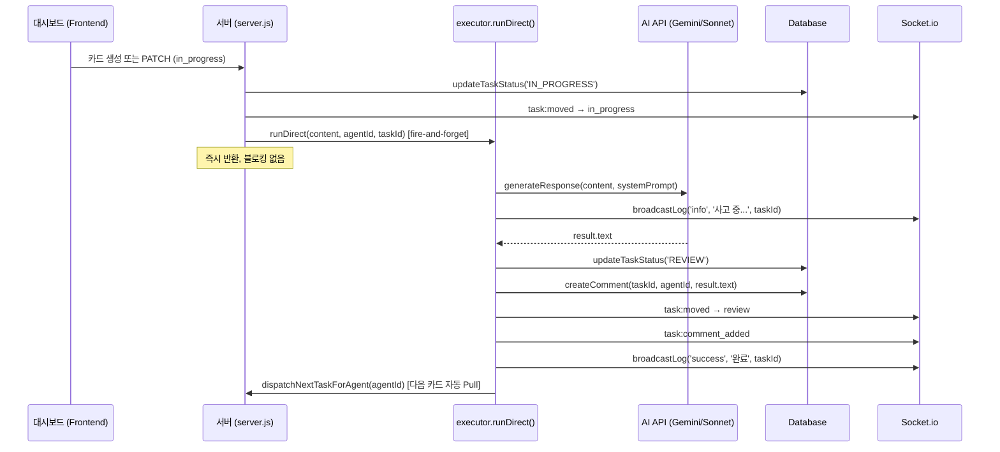
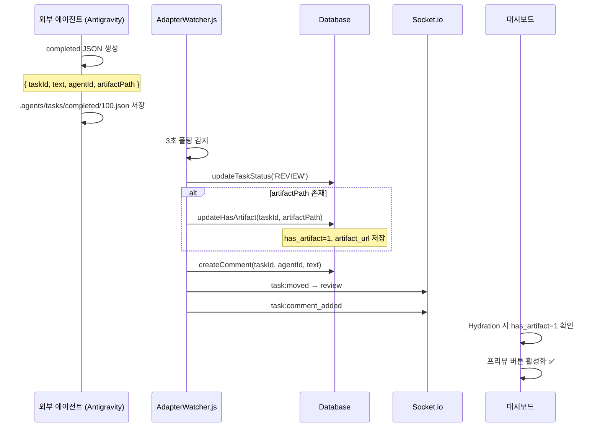
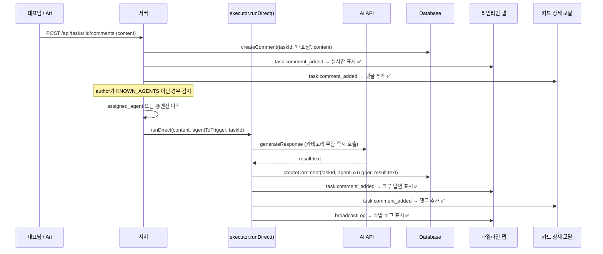
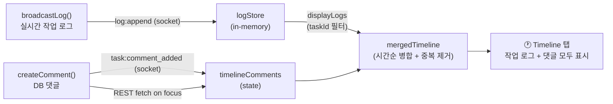

# Phase 26 Sprint 2 — 버그 수정 & 데이터 흐름 보고서
**작성일**: 2026-04-25  
**작성자**: 소넷 (Sonnet)  
**세션 목적**: 자율 파이프라인 안정화 — 5개 버그 수정 + 댓글 핑퐁 구조 검증

---

## 1. 요구사항 목록 (대표님 요청 원문 기준)

| # | 요구사항 | 우선순위 |
|---|---------|---------|
| R1 | 완료 JSON → `completed` 폴더 저장 시, 결과 Text가 카드 댓글에 그대로 작성되어야 한다 | 높음 |
| R2 | 결과물이 Text + 아티팩트를 포함할 경우 **프리뷰 버튼** 활성화 (클릭 시 결과물 뷰어) | 높음 |
| R3 | 할당된 크루가 카드를 받으면 **즉시 작업을 수행**해야 한다 (할당 후 무기력 버그) | 최고 |
| R4 | 타임라인 탭에서 작업 중 로그(broadcastLog)를 실시간으로 확인할 수 있어야 한다 | 높음 |
| R5 | 카드 댓글로 피드백/의견을 남기면 담당 크루가 댓글로 **즉시 답변**해야 한다 (핑퐁) | 높음 |
| R6 | 포커스 기능으로 타임라인에 입력 시, 타임라인 + 카드 댓글 양쪽에 동시 반영되어야 한다 | 높음 |

---

## 2. 버그 수정 내역 (Fix 1 ~ Fix 5)

### Fix 1: 아티팩트 감지 → DB 업데이트 (`database.js`, `AdapterWatcher.js`)

**버그**: `completed` JSON에 `artifactPath`가 있어도 `has_artifact` 플래그가 업데이트되지 않음.  
`artifact_url` 컬럼 자체가 DB에 없었음.

**수정 파일**:
- `database.js` → `artifact_url` 컬럼 마이그레이션 추가
- `database.js` → `updateHasArtifact(taskId, artifactUrl)` 메서드 추가
- `AdapterWatcher.js` → `resultData.artifactPath` 감지 시 `updateHasArtifact()` 호출

**Antigravity 규격**: 크루는 completed JSON에 아래 필드를 포함하면 됨
```json
{
  "taskId": 100,
  "text": "결과 텍스트",
  "agentId": "lily",
  "status": "REVIEW",
  "artifactPath": "/outputs/task_100_result.png"
}
```

---

### Fix 2: 프리뷰 버튼 조건 교체 (`database.js`, `TaskDetailModal.jsx`)

**버그**: 프리뷰 버튼이 `task.column === 'done'` 조건으로 **모든 done 카드**에 표시됨.  
아티팩트 유무와 무관하게 항상 활성화.

**수정 파일**:
- `database.js` → `getAllTasks()` SELECT에 `artifact_url` 추가 (프론트 Hydration 반영)
- `TaskDetailModal.jsx` → 조건 교체

```jsx
// Before (잘못됨): done 카드면 무조건 표시
{(task.column === 'done' || task.column === 'in_progress' || task.latestComment) && (

// After (정확함): 아티팩트가 있을 때만 표시
{task.has_artifact === 1 && (
```

---

### Fix 3: 크루 무기력 버그 수정 (`executor.js`, `server.js`) ⭐ 핵심

**버그 원인**:
```
dispatchNextTaskForAgent()
    └─ filePollingAdapter.execute()
           └─ .agents/tasks/pending/100.json 파일 작성
                    ↑
              [여기서 멈춤 — 파일을 읽어서 실행하는 Consumer 없음]
```

서버 내부에 `pending/` 폴더를 읽어서 실제 AI API를 호출하는 Consumer가 없어,  
10분 타임아웃 후 강제 중단됨.

**수정 파일**:
- `executor.js` → `runDirect()` 메서드 추가 (filePollingAdapter 우회, AI 직접 호출)
- `server.js` → `dispatchNextTaskForAgent`에서 `filePollingAdapter` 제거 → `executor.runDirect()` fire-and-forget 교체

---

### Fix 4: 타임라인 로그 표시 (`LogDrawer.jsx`)

**버그 원인**:  
Timeline 탭은 `logStore`(in-memory) 필터만 표시 → DB 댓글(createComment)은 표시 안 됨.  
두 채널이 분리되어 있어 작업 중 로그가 타임라인에 보이지 않음.

| 채널 | 이전 표시 위치 | 수정 후 |
|------|-------------|--------|
| `broadcastLog` → `log:append` | 전역 로그 피드만 | 타임라인 탭도 ✅ |
| `createComment` → `task:comment_added` | Task Detail Modal 댓글만 | 타임라인 탭도 ✅ |

**수정 파일**: `LogDrawer.jsx`
- `timelineComments` 상태 추가
- `focusedTaskId` 변경 시 REST로 기존 댓글 fetch
- `task:comment_added` 소켓 수신 시 `timelineComments` 실시간 추가
- `mergedTimeline` = DB 댓글 + 실시간 broadcastLog → 시간순 병합 + 중복 제거

---

### Fix 5: 댓글 핑퐁 — AI 즉각 응답 보장 (`server.js`)

**버그 원인**:  
댓글 응답에 `executor.run()` 사용 → CONTENT/MARKETING 분류 시 filePollingAdapter 우회 → 타임아웃.

**수정 파일**: `server.js` (POST `/api/tasks/:id/comments` 핸들러)

```js
// Before
const result = await executor.run(aiRequestText, evaluation, agentToTrigger, sid);

// After — 댓글은 항상 즉각 응답이어야 하므로 runDirect() 사용
const result = await executor.runDirect(aiRequestText, agentToTrigger, sid);
```

---

## 3. 데이터 흐름 다이어그램

### 3-1. 크루 작업 실행 흐름 (Fix 3 후)



---

### 3-2. 아티팩트 완료 흐름 (Fix 1, 2)



---

### 3-3. 댓글 핑퐁 흐름 (Fix 5)



---

### 3-4. 타임라인 표시 채널 (Fix 4)



---

## 4. 수정된 파일 목록

| 파일 | 수정 내용 |
|------|---------|
| `01_아리_엔진/database.js` | `artifact_url` 컬럼 마이그레이션, `updateHasArtifact()` 추가, `getAllTasks()` SELECT 확장 |
| `01_아리_엔진/ai-engine/AdapterWatcher.js` | `artifactPath` 감지 → `updateHasArtifact()` 호출 |
| `01_아리_엔진/ai-engine/executor.js` | `runDirect()` 메서드 추가 |
| `01_아리_엔진/server.js` | `dispatchNextTaskForAgent` filePollingAdapter → `runDirect()` 교체, 댓글 핑퐁 `runDirect()` 교체 |
| `02_워크스페이스_대시보드/src/components/Modal/TaskDetailModal.jsx` | 프리뷰 버튼 조건 `has_artifact === 1` 교체 |
| `02_워크스페이스_대시보드/src/components/Log/LogDrawer.jsx` | Timeline: DB 댓글 + broadcastLog 병합 표시 |

---

## 5. 검증 체크리스트

서버 재시작 후 아래 순서로 테스트:

- [ ] **R3 검증**: Lily에게 카드 할당 → `in_progress` 자동 이동 → 서버 로그 `[Executor.runDirect] 시작` 확인 → `review` 이동 + 댓글 작성
- [ ] **R1 검증**: `review` 이동된 카드 댓글에 AI 결과 텍스트 포함 여부
- [ ] **R2 검증**: `artifactPath` 포함 completed JSON 사용 시 프리뷰 버튼 표시
- [ ] **R4 검증**: 카드 포커스 후 타임라인 탭에 broadcastLog + 댓글 모두 표시
- [ ] **R5/R6 검증**: 카드 댓글 또는 타임라인 입력 → 크루 즉시 답변 → 두 곳 동시 표시
