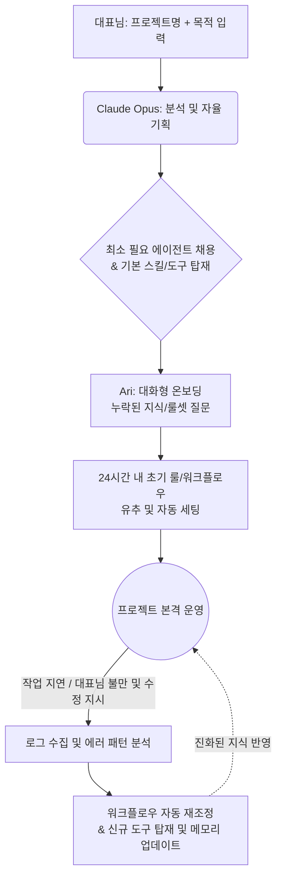

# Phase 28: 프로젝트 단위 독립 환경 및 패널 연동 아키텍처 설계서

## 1. 개요 (Overview)
현재 전역(Global)으로 관리되는 우측 패널(타임라인/채팅)과 에이전트 리소스를 **프로젝트(Project) 단위로 격리 및 최적화**합니다. 프로젝트를 전환하면 해당 프로젝트에 배정된 AI 팀, 타임라인, 채팅 내역, 태스크 보드로 완벽히 스왑되며, 데이터의 격리 및 복원 프로토콜을 체계화하여 엔터프라이즈급 관리 환경을 구축합니다.

---

## 2. 프로젝트 생성 및 맞춤 설정 (Project Setup)
프로젝트마다 목적이 다르므로(예: 마케팅 프로젝트 vs 개발 프로젝트), 생성 시 AI 크루 구성과 데이터 접근 범위를 상세히 설정할 수 있는 플로우를 추가합니다.

### 2.1. 데이터베이스(지식) 격리 수준 설정
프로젝트 간 정보 오염을 막거나 시너지를 내기 위해 3가지 모드를 지원합니다.
*   **전면 격리 (Isolated)**: 다른 프로젝트의 문서나 히스토리를 절대 참조하지 않는 독립 보안 공간 (예: 기밀 신사업).
*   **일부 공유 (Scoped)**: 워크스페이스 내 M-FDS 특정 폴더(예: `05_브랜드_에셋`)에 한해서만 접근 및 참조를 허용.
*   **전면 공유 (Global)**: 워크스페이스 내 모든 범용 지식과 기존 완료된 타 타 프로젝트의 산출물을 자유롭게 참조 (기본값).

### 2.2. Zero-Config 자동 AI 팀 빌딩 (Opus 주도)
사용자(대표님)의 설정 부담을 없애기 위해 **"프로젝트 이름과 목적"** 단 두 가지만 입력하면 시스템이 스스로 팀과 리소스를 구성하는 자율 빌딩 프로세스를 도입합니다.

*   **Opus 기반 자율 기획**: 사용자가 프로젝트 목적을 입력하면 해당 내용(파일/텍스트)이 최고 지능 모델인 Claude Opus에게 전달됩니다. Opus가 목적을 분석하여 최소한으로 필요한 최적의 팀 구성(에이전트 선발), 각 에이전트별 직책(Role), 그리고 적합한 LLM 모델까지 자동으로 배정합니다.
*   **크루 기본 장착 스킬 및 대화형 온보딩 (Interactive Filling)**:
    *   **기본 세팅**: 에이전트 채용 시, 역할에 맞는 공통 스킬(예: 디자이너는 이미지 렌더링 도구, 마케터는 SEO 분석 도구)과 베이스 워크플로우가 기본 탑재됩니다.
    *   **대화형 온보딩**: Opus 분석 결과 시스템에 준비되지 않은 특수 룰(Rule), 핵심 지식, 프롬프트 템플릿이 누락된 것으로 판단될 경우, 마스터 비서(Ari)가 대표님께 자연스러운 채팅을 걸어 질문합니다. ("대표님, 이 프로젝트의 주요 타겟층의 연령대와 톤앤매너는 어떻게 가져갈까요?")
    *   **24시간 유추 초기화**: 비서와의 짧은 대화 내용 및 대표님의 피드백을 기반으로, 시스템은 최초 24시간 내에 프로젝트의 핵심 룰셋과 초기 워크플로우를 스스로 유추하여 세팅(Drafting)합니다.
*   **지속적 진화 (Continuous Evolution)**:
    *   **운영 패턴 및 피드백 로깅**: 프로젝트가 장기(한 달 이상)로 운영되는 동안, 시스템은 백그라운드에서 '작업 지연(Stall)', '빈번한 수정 지시', '대표님의 불만족 피드백' 등을 조용히 수집합니다.
    *   **자가 업데이트 (Auto-Updating)**: 축적된 불만 패턴과 작업 병목 현상을 분석하여, AI 스스로 비효율적인 워크플로우를 재조정합니다. 필요한 신규 도구(Skill)가 있다면 장착을 권건하거나 스스로 연결하며, 특히 잦은 실수가 발생한 부분은 프로젝트 메모리에 "절대 해서는 안 될 금지 룰"로 자동 업데이트하여 지능을 진화시킵니다.

### 2.3. AI 자율 빌딩 및 진화 데이터 흐름도 (Data Flow)

---

## 3. 휴지통 및 복원 정책 (Soft Delete & Restore)
프로젝트 삭제 시 데이터 유실에 따른 리스크를 막기 위해, 즉각적인 하드 삭제(Cascade Delete) 대신 유예 기간을 둡니다.

*   **Soft Delete 격리**: `projects` 삭제 시 연관된 `Task`, `Log`, `TaskComment`에 `deleted_at` 타임스탬프를 일괄 적용하여 메인 UI 및 패널에서 즉시 숨김 처리.
*   **30일 보관소 (Trash Bin)**: 워크스페이스 설정 내 '휴지통' 메뉴에서 삭제된 프로젝트 목록 제공. 30일 이내에 원클릭으로 복원(Restore)하면 얽혀있던 채팅, 태스크, 타임라인 로그가 원래 상태 그대로 부활합니다.
*   **만료 후 영구 삭제 (CRON)**: `deleted_at` 기준 30일이 초과한 데이터는 서버의 백그라운드 워커가 SQLite `CASCADE` 제약을 활용해 DB에서 영구 삭제(Hard Delete)하여 용량을 반환합니다.

---

## 4. 백엔드 및 텔레그램 연동 아키텍처 (Backend & Routing)

### 4.1. Socket.IO Room 동적 바인딩
*   클라이언트 프로젝트 선택 시 `socket.emit('project:join', { projectId })` 발생.
*   모든 로그, 채팅 스트림, 태스크 이벤트는 `io.to(\`project_\${projectId}\`)` 형태로 특정 Room에만 제한 송출.
*   REST API 데이터 조회 및 생성 시 `projectId` 파라미터 강제화.

### 4.2. 텔레그램 외부 연동 라우팅 (Telegram Routing Rules)
모바일(텔레그램)에서 들어온 지시가 어떤 프로젝트 패널로 전송될지 결정하는 방법론입니다.

*   **방법 A: 마스터 비서(Ari)의 문맥 기반 자동 할당 (추천)**
    *   Ari가 메시지를 읽고 "이 내용은 A프로젝트(마케팅)에 적합하네요. 해당 채널로 넘길까요?"라고 묻거나, 확실한 경우 자동 전달 후 알림.
*   **방법 B: 인라인 키보드 (Inline Keyboard) 분기**
    *   명령어 입력 시 텔레그램 하단에 활성화된 프로젝트 목록 버튼을 띄워, 대표님이 직관적으로 도착지를 선택하도록 유도.
*   **방법 C: 해시태그/명령어 라우팅**
    *   `#A프로젝트 이거 리서치해줘`와 같이 메시지 내 식별자를 파싱하여 해당 프로젝트 타임라인으로 즉시 직행.

---

## 5. 프론트엔드 상태 관리 (Frontend Architecture)

*   **Zustand Store (`projectStore.js`)**: `activeProjectId` 상태 중앙 관리. 상태 변경 시 기존 소켓 Room 이탈, 새 Room 조인, REST API Re-fetch 동시 트리거.
*   **Right Panel 컴포넌트**: `activeProjectId`가 `null`일 경우 "프로젝트를 선택해주세요" Empty State 표출. 프로젝트 활성화 시 해당 프로젝트에 소속된 크루의 상태와 활동 내역만 필터링 렌더링.
