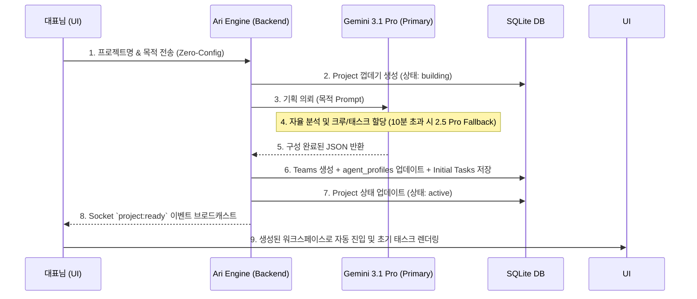

# Phase 28b: Zero-Config 프로젝트 빌딩 자동화 (PRD)

**문서 버전**: v1.0
**작성일**: 2026-05-02
**작성자**: Luca (System Architect)
**목표**: 대표님(CEO)의 인지적 부하 최소화 및 Gemini 3.1 Pro 주도 자율 크루 세팅

---

## 1. 🎯 배경 및 목적 (Background & Objectives)

**배경**:
Phase 28a를 통해 DB, Socket, 프론트엔드의 완벽한 "프로젝트 기반 데이터 격리"가 완료되었습니다. 하지만 현재 워크스페이스를 신규로 생성하려면 대표님이 직접 에이전트 목록을 설정하고 역할을 고민해야 하는 번거로움이 남아 있습니다.

**목적**:
대표님이 **"프로젝트명"**과 **"목적(Prompt)"** 단 두 가지만 입력하면, 최고의 추론 능력을 갖춘 **Gemini 3.1 Pro** 모델이 배후에서 자율적으로 기획을 수행하여 **최적의 에이전트 크루를 구성하고 필요한 초기 태스크를 보드에 자동 세팅**하는 "Zero-Config" 환경을 완성합니다. (10분 타임아웃 시 Gemini 2.5 Pro로 자동 폴백)

---

## 2. 🧩 핵심 기능 요건 (Core Requirements)

### 2.1. UI/UX: Zero-Config 생성 모달
*   **입력 항목 (단순화)**:
    1.  `프로젝트명 (Project Name)`: 예) "마이크루 유튜브 채널 런칭"
    2.  `프로젝트 목적 및 지시사항 (Objective)`: 예) "기술 블로그와 연계해서 주 2회 올라갈 AI 튜토리얼 유튜브 채널을 만들 거야."
*   **시각적 피드백**: 프로젝트 생성 버튼 클릭 시 대시보드 화면에 "🧠 AI가 최적의 크루를 구성하는 중..." 이라는 홀로그램 애니메이션 또는 로딩 스피너 출력.

### 2.2. Backend: 자율 오케스트레이션 파이프라인
*   `POST /api/projects/zero-config` 엔드포인트 신설.
*   **데이터 파이프라인**:
    1.  사용자 입력 수신 -> 새 `project_id` DB 레코드 임시 생성
    2.  입력된 '목적'을 **Gemini 3.1 Pro (High)** 에게 전송 (AntiGravity 브릿지 등).
    3.  *(Fallback)* 응답이 10분을 초과하거나 지연될 경우, **Gemini 2.5 Pro (JSON 모드)** 로 즉시 우회하여 재요청.
    4.  Gemini가 반환한 JSON(크루 구성, 할당된 스킬, 초기 백로그)을 기반으로 DB 레코드 갱신.
    5.  클라이언트에게 `project:ready` 소켓 이벤트로 완료 알림.

### 2.3. AI Logic: 자율 기획(Agentic Planning) 알고리즘
Gemini 3.1 Pro는 수신된 프로젝트 목적을 분석하여 다음의 정형화된 JSON 페이로드를 도출해야 합니다.
```json
{
  "project_name": "...",
  "assigned_crew": [
    {
      "agent_name": "Lumi",
      "role": "유튜브 스크립트 작성 및 톤앤매너 유지",
      "required_skills": ["web_search", "write_document"]
    },
    {
      "agent_name": "Nova",
      "role": "썸네일 이미지 및 시각 자료 생성",
      "required_skills": ["generate_image"]
    }
  ],
  "initial_tasks": [
    { "title": "채널 기획안 초안 작성", "assignee": "Lumi" },
    { "title": "채널 로고 및 배너 이미지 프롬프트 기획", "assignee": "Nova" }
  ]
}
```

### 2.4. 무결성 보장 DB 저장 파이프라인 (Transaction Pipeline)
Zero-Config 파이프라인의 안전한 안착을 위해 AI 응답 처리 후 다음 순서의 **단일 트랜잭션(Single Transaction)** 파이프라인을 엄격히 준수합니다.
1. **Projects 생성**: 사용자 입력값을 바탕으로 `projects` 테이블에 신규 레코드 INSERT (`status: 'building'`).
2. **Teams 생성**: 생성된 `project_id`를 외래키로 참조하는 전담 팀 레코드를 `teams` 테이블에 신규 INSERT (추후 1:N 확장 지원을 위한 구조적 대비).
3. **Agent_Profiles 맵핑 및 업데이트**: 
   - AI가 기획한 `assigned_crew` 명단을 바탕으로, 해당 워크스페이스에 투입될 에이전트들의 정보를 조회.
   - `agent_profiles` 테이블(또는 `team_agents` 연결 테이블)에 해당 에이전트들을 생성된 `team_id`에 할당.
   - 각 에이전트의 고유 역할과 지시사항(role)을 프로필의 `system_prompt` 필드에 동적으로 덮어써서 프로젝트 특화 컨텍스트를 주입.
4. **Tasks 생성**: JSON으로 전달받은 `initial_tasks` 목록을 순회하며 `tasks` 테이블에 초기 백로그 상태(`column: 'todo'`)로 일괄 INSERT.
5. **완료 및 활성화**: 모든 데이터가 정상적으로 저장되면 `projects` 레코드의 상태를 `active`로 전환하고 커밋(Commit)합니다. 중간에 에러 발생 시 전체 롤백(Rollback)하여 반쪽짜리 데이터가 남지 않게 방어합니다.

---

## 3. 🔄 아키텍처 및 데이터 흐름도 (Architecture Flow)



---

## 4. 🚀 단계별 구현 계획 (Implementation Sprints)

### Sprint 1: Gemini 기획 프롬프트 및 백엔드 로직 구축
*   [ ] `zeroConfigService.js` 신설 (Gemini 3.1 Pro 프롬프트 템플릿 및 10분 Fallback 로직 포함).
*   [ ] `POST /api/projects/zero-config` API 엔드포인트 구현.
*   [ ] Gemini 3.1 Pro 모델을 호출하여 안정적인 JSON 응답을 받아오는지 단위 테스트.

### Sprint 2: 데이터베이스 연동 및 Socket 통신
*   [ ] Gemini가 반환한 JSON을 바탕으로 **`teams` 생성**, **`agent_profiles` 업데이트**, **`tasks` 테이블 Insert** 로직을 단일 트랜잭션으로 파이프라인 구성.
*   [ ] 비동기 작업 완료 시 프론트엔드로 `project:ready` 소켓 이벤트 전송 로직 구현.

### Sprint 3: 프론트엔드 UI/UX 구현
*   [ ] 대시보드의 기존 "새 프로젝트" 모달을 Zero-Config 디자인으로 개편.
*   [ ] 로딩 중 스켈레톤 UI 또는 애니메이션 추가.
*   [ ] 완료 시 해당 프로젝트 룸으로 자동 스위칭 (`projectStore.setProjectId`).

---

**[논의 사항 / 리스크]**
- Gemini 3.1 Pro 호출 시 추론이 지연되어 10분이 넘어갈 경우, 타임아웃 처리와 동시에 안정적인 JSON 파싱이 보장되는 Gemini 2.5 Pro로 Fallback하여 즉각 대응합니다.
- 대기 시간이 길어질 수 있으므로 프론트엔드에서 이탈하지 않도록 UI 적으로 충분한 기대감을 주는 "🧠 AI가 프로젝트를 설계 중입니다..." 대기 화면 처리가 필수적입니다.
