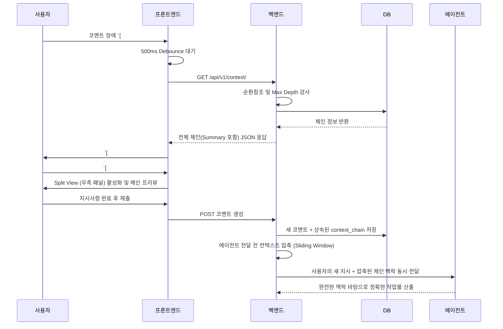

# PRD: 컨텍스트 체이닝 (Context Chaining) 기능 기획 (v1.4 Final)

**작성일**: 2026-05-07
**작성자**: MyCrew 기획/개발팀 (Sonnet, Luca)
**검토자**: DEV_ADVISOR, PRIME
**상태**: 🟢 승인 완료 및 개발 착수

---

## 1. 개요 (Overview)
**기능명**: 컨텍스트 체이닝 (Context Chaining) for Agent Instructions

**문제 정의 (Problem Statement)**:
에이전트에게 업무를 지시할 때, 여러 카드와 코멘트에 흩어져 있는 과거 맥락을 전달해야 하는 경우가 많습니다. 현재 사용자는 필요한 참조 ID들을 수동으로 찾아 여러 번 복사/붙여넣기 해야 하며, 이 과정은 번거롭고 시간이 많이 소요될 뿐만 아니라 누락의 위험이 존재합니다.

**목표 (Goal)**:
사용자가 단 하나의 참조 ID(`[#ID]`)만으로 관련된 모든 과거 맥락을 상속받아 전달할 수 있는 '컨텍스트 체인' 기능을 구현합니다. 이를 통해 한 번의 참조 액션으로 완전한 히스토리를 제공하고, 코멘트 작성 시 우측 프리뷰(Split View)를 통해 참조 체인 전체를 시각적으로 검증하며 지시할 수 있는 워크플로우를 완성합니다.

---

## 2. 사용자 스토리 (User Stories)
- **As a user,** 이전 참조가 가진 모든 맥락을 상속받는 새로운 참조를 생성하여, 시간에 따라 연계된 정보의 사슬(Chain)을 만들고 싶다.
- **As a user,** 최종 참조 ID 하나만 붙여넣으면 에이전트가 자동으로 전체 맥락 체인을 전달받게 하여, 여러 ID를 수동으로 취합하는 번거로움을 없애고 싶다.
- **As a user,** 코멘트 입력창에 체인 ID를 입력했을 때 우측 분할 화면(Split View)에서 상속된 모든 컨텍스트 내역을 확인하여, 정확한 맥락을 전달하고 있는지 실시간으로 검증하고 싶다.

---

## 3. 핵심 요구사항 (Core Requirements)

### 3.1 참조 문법 및 감지
- **대괄호 문법**: 컨텍스트 체인을 생성/참조할 때는 대괄호 `[]`로 기존 참조 ID를 감쌉니다. (예: `[#12]`, `[#15C3]`)
- **감지 정규식**: 프론트/백엔드 공통으로 `\[(#\d+(C\d+)?)\]` 정규식을 통해 체인 참조를 식별합니다.

### 3.2 데이터 상속 구조 (Backend)
- **DB 스키마**: `Task` 및 `TaskComment` 테이블에 `context_chain` 컬럼(JSON)을 추가합니다.
- **상속 로직**: 새 코멘트 작성 시, 참조한 부모의 `context_chain`을 읽어온 뒤 본인(Ref ID)을 덧붙인 새로운 배열을 `context_chain`에 저장합니다. (예: 부모가 `["#1", "#3"]`을 가졌다면 새 체인은 `["#1", "#3", "#5"]`)

### 3.3 리치 컨텍스트 프리뷰 (Frontend)
- **UI 변환**: 입력된 `[#ID]` 텍스트는 유효성 검증을 거쳐 **클릭 가능한 인라인 칩(Chip) 버튼**으로 변환됩니다.
- **Split View 재활용**: `[#ID]` 클릭 시 우측에 분할 화면이 열리며 해당 체인에 속한 모든 컨텍스트 내역이 리스트 형태로 렌더링됩니다.
- **중첩 탐색(Drill-down)**: 우측 프리뷰 안의 다른 `[#다른ID]`를 클릭하면, 좌측(작업창)은 고정된 상태에서 우측 내용만 새로운 체인으로 교체되며 상단에 **`< 뒤로가기`** 내비게이션이 활성화됩니다.
- **UX 최적화 (Advisor 반영)**: 무효한 ID나 에러 발생 시(순환참조 등) 버튼 색상이 붉은색(Error)으로 변경되고 툴팁을 제공하여 시각적 피드백을 강화합니다. 사용자의 타이핑 부하를 줄이기 위해 API 검증에는 `300~500ms Debounce`가 적용됩니다.

### 3.4 API 및 파이프라인 (API & Pipeline)
- **엔드포인트**: `GET /api/v1/context/{refId}/{projectId}`
- **AI 컨텍스트 압축 (Sliding Window)**: 토큰 폭발을 방지하기 위해 LLM 프롬프트에 체인을 주입할 때, 최신 3개의 컨텍스트는 '전체 본문'을 전송하고 그 이전의 컨텍스트는 본문 앞 200자만 자른 'Summary'로 압축하여 전송합니다.

---

## 4. 시스템 안정성 및 방어벽 (Security & Stability)
순환 참조나 과도한 중첩으로 인한 서버 부하(무한 루프)를 막기 위해 다음과 같은 필수 방어 로직을 적용합니다.

1. **최대 깊이 제한 (Max Depth)**
   - 체인의 상속 한계를 환경 변수(`CONTEXT_CHAIN_MAX_DEPTH`)로 관리하며, 기본값은 **10**으로 제한합니다. 깊이를 초과한 내용은 자동 절삭됩니다.
2. **순환 참조 감지 (Circular Dependency)**
   - 백엔드 탐색 중 이미 체인에 포함된 ID가 다시 발견되면 즉시 탐색을 중단하고 API에 에러 상태(`truncated_chain`)를 반환합니다.

---

## 5. 워크플로우 다이어그램 (Workflow)

---
**[결재 내역]**
- `DEV_ADVISOR`: "UX 설계와 토큰/순환참조 방어 로직이 훌륭함. 즉시 개발 착수 승인 (A+)"
- `PRIME`: "에이전트 한계를 명확히 분리한 기획. 기존 파서 및 테이블과의 통합은 엔진 개발자(Luca)에게 위임하여 개발 속행. (A)"
