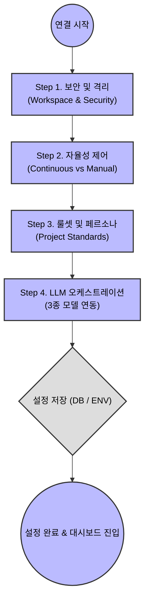

# Phase 39: MyCrew MCP 온보딩 설정 UX 기획서
**작성일**: 2026-05-09  
**작성자**: 루카 (Luca)  
**상태**: ✅ Draft (리뷰 대기)

---

## 1. 개요 (Overview)
본 문서는 사용자가 최초로 마이크루(MyCrew) 계정을 생성하거나 크롬 익스텐션(MCP 서버)을 연동할 때 마주하게 되는 **'초기 설정 마법사(Onboarding Wizard)'**의 UX와 시스템 아키텍처를 기획합니다.

다른 단순한 MCP 서버들과 달리, 마이크루는 사용자의 로컬 파일시스템과 칸반을 모두 제어하는 '운영체제(AI OS)' 역할을 합니다. 따라서 사용자가 불안감을 느끼지 않도록 **보안 권한을 명확히 설정**하고, 자신의 업무 스타일에 맞게 **에이전트의 자율성을 튜닝**할 수 있는 UX가 필수적입니다.

---

## 2. 온보딩 플로우 시각화 (User Flow)



---

## 3. 단계별 설정 명세서 (Step-by-Step Details)

### 🛡️ Step 1. 보안 및 샌드박스 설정 (Security & Sandbox)
에이전트에게 물리적인 파일 접근 권한과 위험한 행동에 대한 제동 장치를 설정합니다.

*   **작업 디렉토리(Workspace Base Path) 지정**: 
    *   에이전트가 코드를 읽고 쓸 수 있는 최상위 폴더를 지정합니다. (예: `/Users/username/mycrew_projects`)
    *   이 경로를 벗어난 파일 시스템 접근은 MCP 서버단에서 하드 블락(Hard Block) 처리됩니다.
*   **액션 위험도별 승인(Approval) 게이트 설정**:
    *   `[Toggle]` 파일 생성 및 덮어쓰기: 자동 허용 / 확인 후 실행
    *   `[Toggle]` 파일 삭제: 자동 허용 / 확인 후 실행 (기본값: 확인 후 실행)
    *   `[Toggle]` 터미널(Bash) 명령어 실행: 무조건 승인 필요 (고정 옵션 - 보안 강화)

### 🤖 Step 2. 자율성 및 워크플로우 제어 (Autonomy Level)
에이전트가 칸반 보드의 카드를 처리할 때 얼마나 자율적으로 달릴지 기본 모드를 설정합니다.

*   **기본 주행 모드 선택 (Radio Button)**:
    *   `수동 검증 모드 (Manual/Step-by-step)`: 작업 하나(카드 한 장)가 끝날 때마다 멈추고 사용자의 승인(Next)을 기다립니다.
    *   `연속 질주 모드 (Continuous)`: 큐(Queue)에 있는 모든 작업을 에러가 발생하기 전까지 자동으로 연속 처리합니다.
*   **에러 발생 시 행동 지침 (Dropdown)**:
    *   에러 발생 시 스스로 3회까지 트러블슈팅 시도 후 실패 시 보고.
    *   에러 발생 즉시 멈추고 사용자에게 해결 방안(인터벤션) 요청.

### 📜 Step 3. 프로젝트 룰셋 및 페르소나 (Project Standards)
개발 언어와 산출물의 표준을 맞춰 환각(Error)을 줄이고 팀의 일관성을 맞춥니다.

*   **주력 기술 스택 선택**: React, Node.js, Python 등 (체크박스 다중 선택)
*   **응답 및 주석 언어**: `한국어(Korean)` / `영어(English)`
*   **코딩 컨벤션 강제화 (Toggle)**: 
    *   On으로 설정 시, 새 프로젝트 생성마다 시스템이 자동으로 `strategic_memory.md` (또는 `.cursorrules`) 파일을 만들어 해당 룰을 강제합니다.

### 🧠 Step 4. 주력 LLM 연동 및 오케스트레이션 (LLM Orchestration)
사용자가 마이크루 MCP를 어떤 AI 클라이언트와 조합해서 쓸지 정의합니다.

*   **연결할 클라이언트 환경 (다중 선택)**: `Antigravity`, `Cursor`, `Claude Code` 등
*   **MyCrew 3종 LLM 시너지 모드 (Toggle)**:
    *   이 기능을 켜면, 작업의 성격에 따라 마이크루가 최적의 모델을 분배합니다.
    *   *기획/분할*: Claude Opus 4.6 (Thinking) 또는 Gemini 3.1 Pro (High)
    *   *실행/코딩*: Claude Sonnet 4.6 (Thinking)
    *   *리뷰/인프라*: Gemini 1.5 Pro (루카)

---

## 4. 데이터 저장 및 프롬프트 주입 아키텍처 (Backend Logic)

### 4.1. 설정 데이터의 영구 저장
*   온보딩 완료 시, 입력된 설정값은 MyCrew SQLite DB의 `User_Preferences` 테이블에 JSON 형태로 저장됩니다.
*   디렉토리 경로 등 민감한 로컬 설정은 서버가 구동되는 시점의 `.env` 환경 변수와 병합되어 메모리에 로드됩니다.

### 4.2. 시스템 프롬프트(System Prompt) 자동 주입
에이전트가 MCP 서버(MyCrew)를 호출할 때마다, 이 설정값들이 백그라운드에서 에이전트의 뇌(Prompt)에 자동 주입됩니다.

**[주입 예시 (Injection Payload)]**
```json
{
  "context": "System",
  "instruction": "당신은 현재 [연속 질주 모드]로 동작 중입니다. 묻지 말고 다음 카드를 실행하세요.",
  "security_rules": "절대 /Users/alex/mycrew_projects 경로 밖의 파일을 수정하지 마세요.",
  "language": "모든 코드의 주석과 커밋 메시지는 한국어로 작성하세요."
}
```

---

## 5. 결론 및 기대 효과
이 온보딩 UX가 도입되면, 사용자는 단순한 플러그인을 설치하는 느낌이 아니라 **"나만의 완벽한 맞춤형 AI 개발팀 환경(Studio)을 세팅한다"**는 강력한 록인(Lock-in) 효과와 신뢰감을 얻게 됩니다. 또한 프롬프트를 매번 칠 필요 없이 설정된 Rule이 시스템 레벨에서 자동 강제되므로 업무 효율이 비약적으로 상승합니다.
