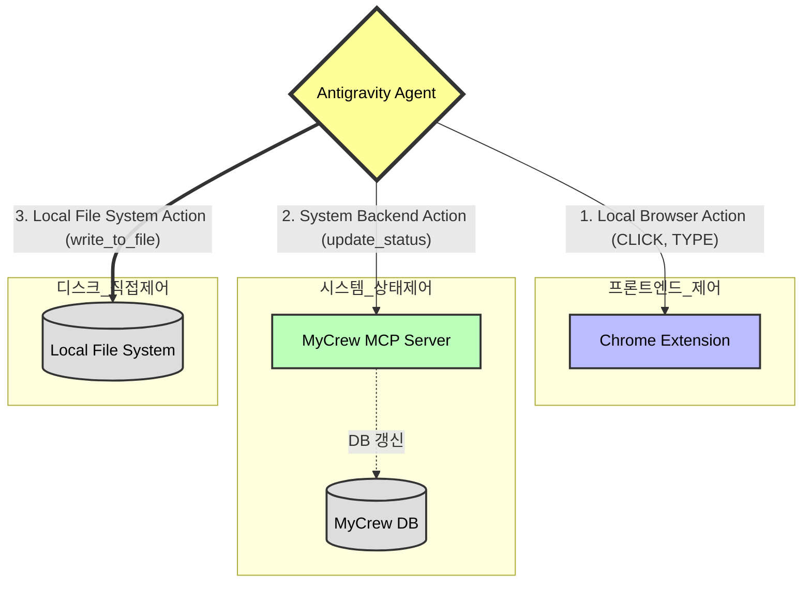

# Phase 39: 태스크 도구(Tool) 및 액션 분류 기획서
**작성일**: 2026-05-09  
**작성자**: 루카 (Luca)  
**상태**: ✅ 확정  

---

## 1. 개요 (Overview)
본 문서는 Phase 38-1의 크롬 익스텐션 제어 명령 시스템과 Phase 39의 MCP V2 아키텍처를 통합하여, 에이전트(Antigravity)가 활용할 수 있는 **태스크 도구(Action)의 종류와 계층을 3가지로 명확히 분류**합니다.

---

## 2. 도구 계층 직관적 구조도 (Box & Line)

```text
[ Agent Execution Engine ]
         │
         ├──▶ [ 1. Local Browser Action ]
         │      - 타겟: 브라우저 화면 (DOM)
         │      - 도구: CLICK, TYPE, SCROLL, /context
         │      - 목적: 프론트엔드 물리적 조작 및 시각 정보 스크래핑
         │
         ├──▶ [ 2. System Backend Action (MCP) ]
         │      - 타겟: MyCrew Server & DB (SQLite)
         │      - 도구: update_task_status, create_task, assign_agent
         │      - 목적: 칸반 상태 변경, 시스템 제어, 팀 조율
         │
         └──▶ [ 3. Local File System Action ]
                - 타겟: 로컬 디스크 (Mac OS)
                - 도구: write_to_file, run_command, replace_file_content
                - 목적: 실제 산출물(코드/기획서) 저장 및 터미널 엑세스
```

---

## 3. 도구 실행 흐름 다이어그램 (Flowchart)

대표님께서 요청하신 "직관적 구조도와 데이터 플로우 형태"의 시각화 다이어그램입니다. 네이티브 뷰어 렌더링에 최적화되어 있습니다.



---

## 4. 도구 분류 상세 명세서

### 4.1 System Backend Action (시스템 제어 및 상태 관리 도구)
마이크루의 핵심 백엔드(DB, 칸반)를 제어하는 도구입니다. Phase 39부터 표준 **MCP Tool** 형태로 제공됩니다.
*   **`update_task_status`**: 칸반 카드의 상태(To Do, In Progress, Review, Done)를 변경합니다. (Medium 위험도 - 승인 권장)
*   **`create_task`**: 새로운 칸반 카드를 Inbox에 생성합니다. (Low 위험도 - 자동 실행 허용)
*   **`assign_agent`**: 특정 작업에 크루(다른 에이전트)를 할당하거나 담당자를 변경합니다.
*   **`/task` (Slash Command)**: 사용자가 프롬프트 없이 즉각적으로 카드를 생성할 때 쓰는 단축 명령어.

### 4.2 Local Browser Action (프론트엔드 DOM 제어 도구)
에이전트가 크롬 익스텐션을 통해 사용자의 **브라우저 화면을 직접 물리적으로 조작**하는 도구입니다.
*   **`CLICK`**: 화면의 특정 요소(버튼, 링크)를 클릭합니다.
*   **`TYPE`**: 입력 폼이나 텍스트 박스에 텍스트를 입력합니다.
*   **`SCROLL`**: 화면을 위아래로 스크롤하여 더 많은 컨텍스트를 확보합니다.
*   **`/context` (Slash Command)**: 1회성 휘발성 메모리 리소스(`resources://mycrew/context`)로 현재 보고 있는 탭의 텍스트를 즉시 캡처해 옵니다.

### 4.3 Local File System Action (디스크 제어 / Antigravity 내장 도구)
아리 엔진(MyCrew)이 강제하지 않아도, LLM(Antigravity)이 기본적으로 내장하고 있는 가장 강력한 네이티브 도구들입니다.
*   **`write_to_file`**: 새로운 코드를 작성하거나 기획서 파일을 디스크에 생성합니다.
*   **`replace_file_content`**: 기존 코드를 수정하거나 리팩토링합니다.
*   **`run_command`**: 터미널 커맨드를 실행하거나 의존성 패키지(`npm install`)를 설치합니다.

---

## 5. 파이프라인 결합 시나리오 (Synergy Example)
위 3가지 도구군이 결합되면, 에이전트는 다음과 같은 완전한 자율 파이프라인을 탈 수 있습니다.

1.  **할 일 확인**: MCP 리소스(`resources://tasks/pending`) 조회
2.  **작업 수행**: `write_to_file`로 로컬에 코드 작성 **(3번 도구군)**
3.  **상태 변경**: `update_task_status`로 MyCrew 칸반 완료 처리 **(1번 도구군)**
4.  **완료 보고**: `TYPE`으로 익스텐션 채팅창에 보고 텍스트 입력 후 `CLICK`으로 전송 **(2번 도구군)**
