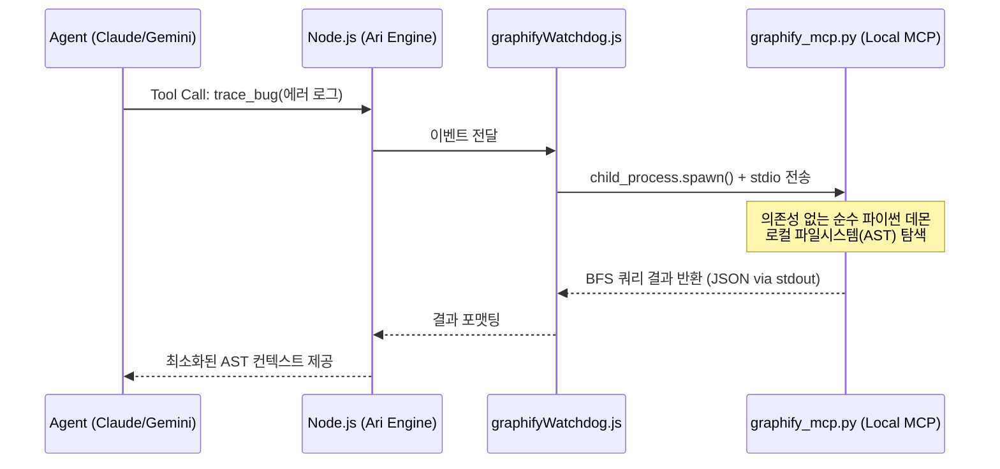
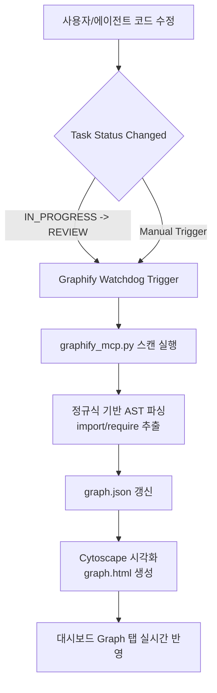
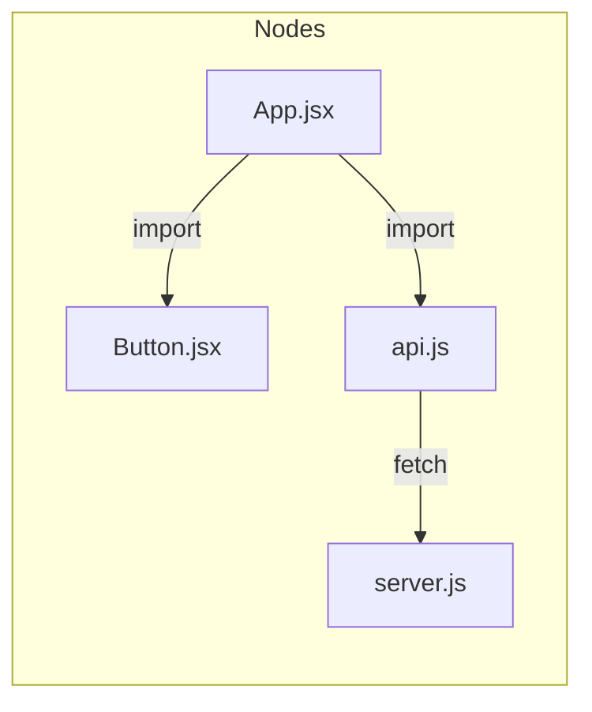
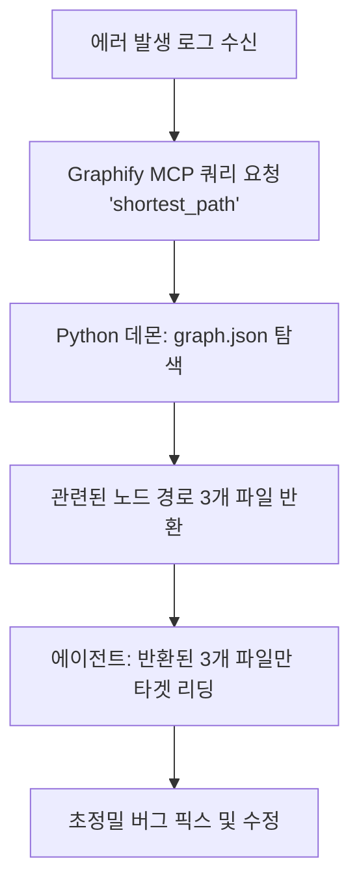

# Phase 40: My-Graph (Graphify 내재화) 아키텍처 기획서

**작성일**: 2026-05-11
**작성자**: Luca
**상태**: ✅ Draft
**연결 문서**: [Phase40_Graphify_연동_기획서](Phase40_Graphify_연동_기획서.md)

---
# 1.목적 
'My-Graph (Graphify 내재화 시스템)'의 가장 큰 존재 이유이자 핵심이 바로 **'초정밀 코드 추적(Code Tracing)과 토큰/컨텍스트 최적화'**입니다.

## 2. 문제 
기존 AI 에이전트들의 가장 큰 취약점은 에러가 났을 때 **'이 문제가 정확히 어디서부터 시작되었는지'**를 찾기 위해 무작정 수십 개의 파일을 열어보거나 텍스트 검색(grep)을 남발한다는 것이었습니다. 이 방식은 토큰(비용)을 엄청나게 낭비할 뿐만 아니라, 입력 제한(Context Window)이 금방 꽉 차버려서 에이전트가 "내가 애초에 뭘 찾고 있었지?" 하며 **환각(Hallucination)**에 빠지는 주된 원인이었습니다.

## 3. 개요 및 내재화(Internalization) 시스템 철학
MyCrew의 'My-Graph' 아키텍처는 외부의 상용 Graphify 서비스나 원격 MCP를 호출하는 방식이 아닙니다. **Graphify의 핵심 메커니즘을 초경량화하여 마이크루 내부에 '완전 이식(Clone & Embed)'하는 하이리드 로컬 아키텍처**입니다. 

외부 의존성 패키지를 배제하고, 순수 Python 표준 라이브러리(`sys`, `json`, `os`, `re`)만을 활용하여 AST(추상 구문 트리) 파싱 엔진과 BFS 기반 Cypher 쿼리 엔진을 구현한 `graphify_mcp.py`를 마이크루의 Node.js 백엔드에 직접 결합했습니다.

### 💡 시스템 연동 아키텍처 (Node.js ↔ Python 브릿지)
포트 충돌과 네트워크 오버헤드를 원천 차단하기 위해 **표준 입출력(stdio)** 통신을 활용합니다.

---

## 4. 데이터 수집 흐름 (Data Collection Flow)
지식 그래프는 무작위로 수집되는 것이 아니라, 칸반 시스템의 생명주기(Lifecycle)와 완벽하게 동기화되어 동작합니다.

* **수집 방식**: 에이전트가 코딩을 완료하고 `REVIEW` 컬럼으로 카드가 이동하는 순간, 백그라운드 Watchdog이 즉각적으로 파이썬 파서를 호출해 프로젝트 디렉토리의 최신 의존성 관계를 갱신합니다.

---

## 5. 그래프 작동 원리 (Graph Operation Principles)
지식 그래프는 코드를 단순 텍스트가 아닌 **노드(Node)**와 **간선(Edge)**의 관계로 정의합니다.

1. **노드 (Node)**: 각 파일(`App.jsx`, `api.js` 등)이나 주요 함수 블록.
2. **간선 (Edge)**: 파일 간의 `import`, `require`, `호출(Call)` 관계.
3. **BFS 쿼리 엔진**: 에러가 발생한 지점(`D`)과 의심되는 출발점(`A`)이 주어질 때, 그래프 상의 최단 경로(Shortest Path)를 계산하여 중간에 거쳐간 파일(`C`)만 정확히 추출해냅니다.

---

## 6. 에이전트 탐색 작동 원리 및 토큰 효율화 (Token Optimization)
에이전트(Luca/Sonnet)가 코드를 수정하거나 버그를 잡을 때, **전체 파일을 읽는 무식한 행위(Full-text Scan)를 원천 차단**합니다. 

### 💡 탐색 흐름 (Zero-Context Debugging)

### 📉 토큰 효율화 파급 효과
1. **90% 이상의 토큰 절감**: 수백 개의 파일을 뒤지지 않고, 그래프 좌표를 통해 연관된 파일 3~4개만 타겟팅하므로 입력 토큰 소모가 극적으로 줄어듭니다.
2. **응답 속도 향상**: 전체 코드베이스를 분석하는 데 걸리는 대기 시간 없이, 로컬 파이썬 데몬의 밀리초(ms) 단위 경로 계산을 통해 즉각적으로 추론(Sequential Thinking)을 시작합니다.
3. **문맥 손실(Hallucination) 방지**: 연관 없는 코드가 프롬프트에 섞이지 않아 에이전트의 포커스가 분산되지 않고 정확도 높은 디버깅이 가능해집니다.

### Debuging 시나리오
1. AI 전용 내비게이션: 에러가 발생하면 Mycrew에이전트는 이제 파일을 찾지 않습니다. 대신 My-Graph에게 *"A 파일에서 에러가 났는데, 데이터를 넘겨주는 C 모듈 사이의 최단 경로(Shortest Path)만 뽑아줘"*라고 쿼리를 던집니다.
핀포인트(Pinpoint) 탐색: My-Graph 데몬이 즉각적으로 그래프를 탐색해 *"A ➔ B ➔ C 순서로 호출되고 있으니, 딱 이 3개 파일만 확인해"*라고 정확한 좌표를 찍어줍니다.
토큰 다이어트 (Zero-Context): 에이전트는 전체 코드가 아닌 딱 그 3개 파일만 읽고 버그를 고치게 됩니다. 파일을 찾는 과정에 토큰을 소모하지 않습니다.

---

## 7. 확장판: 기획 모드(ARCHITECT) 연동 구현 (Phase 39-1)
기존 리뷰 및 디버깅 모드에서만 활성화되던 Graphify 연동 기능이 기획 파트(Architect)까지 완전히 확장 구현되었습니다.

### 💡 기획 시나리오 적용 내역
1. **`query_architecture` 도구 신설**: 아키텍트 에이전트(Claude Opus)가 새로운 기능(Feature)을 기획하거나 로드맵을 작성하기 전에, 현재 시스템의 전체 아키텍처와 의존성을 파악할 수 있는 전용 MCP 도구를 `mcp_server.js`에 추가했습니다.
2. **Selective Tool Loading 최적화**: 이 도구는 `ARCHITECT` 또는 `PLAN_MASTER` 모드에서만 선택적으로 로드됩니다.
3. **작동 흐름**: 아키텍트 에이전트는 무작정 코드 파일을 열어보는 대신, `query_architecture`를 호출해 `dependencies(App.jsx)` 같은 Cypher 쿼리를 Graphify 데몬으로 전송하여 즉각적으로 의존성 맵을 파악합니다. 이를 통해 **기존 아키텍처를 훼손하지 않는 완벽한 구조적 기획서(PRD)**를 토큰 낭비 없이 작성할 수 있습니다.