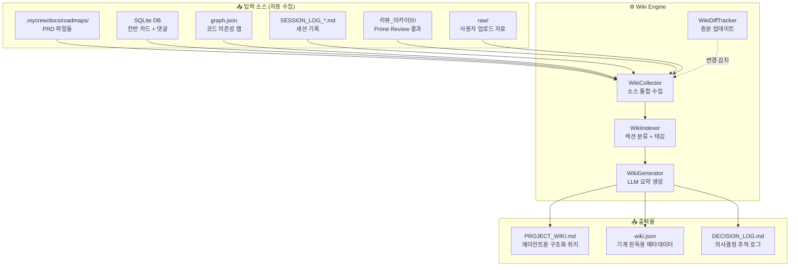
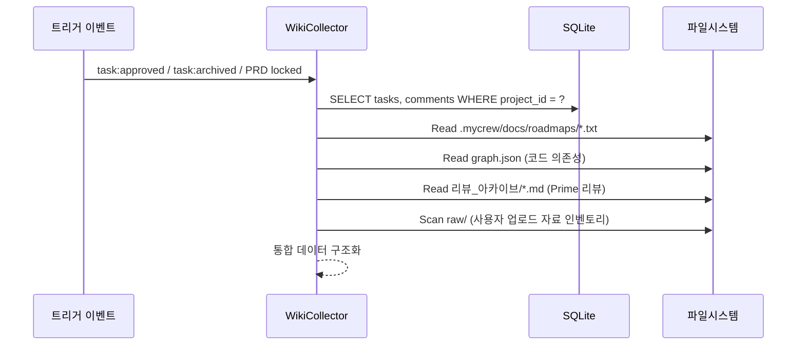
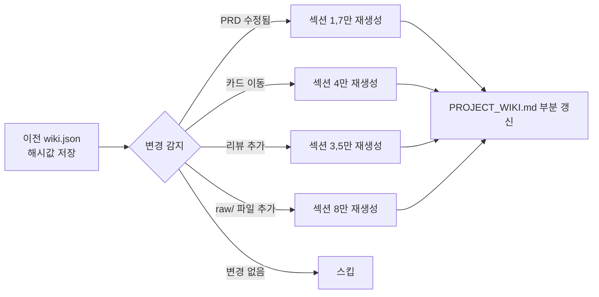
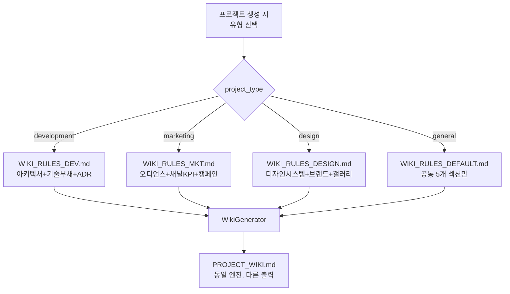

# Phase 41: Project LLM Wiki — 프로젝트 지식 위키 자동 생성 시스템

**작성일**: 2026-05-11
**작성자**: Sonnet (기획·설계) — 대표님 요청
**상태**: 📋 Draft (구조 설계 완료)
**연결 문서**: 
- [Phase40_My_Graph_아키텍처_기획서](Phase40_My_Graph_아키텍처_기획서.md) — My-Graph 코드 추적 시스템
- [Phase39-1_Plan_Master_관련_기획서](Phase39-1_Plan_Master_관련_기획서.md) — Plan Master 기획 파이프라인
**참조**: [Graphify --wiki 모드](https://javaexpert.tistory.com/1718) (카파시의 위키 구현 버전)

---

## 1. 문제 정의

> *"프로젝트마다 기획서, 자료 등이 폴더에 쌓이게 된다."*

MyCrew 사용자가 프로젝트를 운영하면서 자연스럽게 축적되는 산출물들이 있습니다:

| 산출물 유형 | 현재 위치 | 문제점 |
|---|---|---|
| PRD/기획서 (v1.0, v2.0...) | `.mycrew/docs/roadmaps/` | 버전이 쌓이면 "최신이 뭔지" 혼란 |
| 칸반 댓글·코드리뷰 기록 | SQLite DB (comments 테이블) | 검색 불가, 맥락 단절 |
| 에이전트 사고과정 (Thinking) | Activity 탭 로그 | 1회성, 다음 세션에서 소실 |
| My-Graph 의존성 맵 | `graph.json` / `graph.html` | 코드 구조만 있고, "왜 이렇게 설계했는지" 없음 |
| 대표님 피드백·리워크 사유 | 댓글 + broadcastLog | 분산, 비구조화 |
| **사용자 업로드 자료** (이미지, PDF, 참고문서) | **집합점 없음** (DB에 경로만 기록, 물리 파일 분산) | 에이전트가 다음 세션에서 접근 불가, 위키 수집 사각지대 |

**핵심 문제**: AI 에이전트가 다음 세션에서 *"이전에 대표님이 왜 이 기능을 거절했지?"*, *"이 모듈의 설계 의도가 뭐였지?"* 같은 질문에 답하려면 **모든 파일을 다시 읽어야** 합니다. 이것이 바로 Graphify가 풀고자 한 "raw 파일 재탐색" 문제의 **프로젝트 관리(PM) 버전**입니다.

---

## 2. 해결 방안: Project LLM Wiki

Graphify의 `--wiki` 모드에서 영감을 받되, MyCrew의 고유 자산(칸반, Plan Master, My-Graph)을 활용하여 **코드 + 기획 + 의사결정 기록을 하나의 구조화된 위키로 자동 생성**합니다.

### 💡 핵심 철학
```
"AI가 프로젝트를 이해하려면 코드만이 아니라, 
 기획 의도 + 거절 사유 + 변경 이력까지 한눈에 봐야 한다."
```

이것은 Graphify의 "코드 + 문서 + 이미지 → 지식 그래프" 접근을 **코드 + PRD + 칸반 + 리뷰로그 → LLM 위키**로 확장한 것입니다.

---

## 3. 시스템 아키텍처



---

## 4. Wiki 자동 생성 파이프라인

### 4.1 Phase 1: 수집 (Collect)


**트리거 시점** (Graphify의 Watchdog 패턴 응용):
- 칸반 카드가 `Done`으로 이동할 때
- PRD가 `.locked` 될 때 (Plan Master confirm)
- 수동 명령: `/wiki update`

### 4.2 Phase 2: 분류 (Index)
수집된 데이터를 **8개 위키 섹션**(Johnny Decimal 10단위 번호 체계)으로 자동 분류합니다:

| 섹션 | 소스 | 내용 |
|---|---|---|
| `## 10. 프로젝트 개요` | PRD v1.0 | MVP 정의, 핵심 기능 목록 |
| `## 20. 아키텍처 맵` | graph.json | 주요 모듈 관계, god node, 의존성 경로 |
| `## 30. 의사결정 기록 (ADR)` | 댓글 + 리워크 로그 | **Context→Decision→Alternatives→Consequences** 4단 형식 |
| `## 40. 기능별 상태` | 칸반 카드 | 각 기능의 현재 진행 상태 (Todo/Done/Blocked) |
| `## 50. 기술 부채` | 리뷰 아카이브 | Prime Review에서 지적된 미해결 항목 |
| `## 60. 변경 이력` | SESSION_LOG | Phase별 변경 요약 타임라인 |
| `## 70. 확장 로드맵` | PRD v2.0 + Future Scope | 백로그 및 향후 계획 |
| `## 80. 참조 자료 인벤토리` | **raw/** 폴더 | 사용자 업로드 이미지·PDF·참고문서 목록 + 요약 |

> **섹션 30 — ADR 형식 (Socian Wiki 차용)**: 의사결정 기록은 단순 시간순 나열이 아니라, 각 엔트리를 **맥락(Context) → 결정(Decision) → 검토한 대안(Alternatives) → 결과(Consequences)** 4단 구조로 작성합니다. 이를 통해 에이전트가 "왜 이 결정을 했고, 어떤 대안을 버렸는지"까지 정확히 파악할 수 있습니다.

### 4.3 Phase 3: 생성 (Generate)

```javascript
// WikiGenerator 핵심 로직 (server.js 또는 별도 서비스)
app.post('/api/projects/:id/wiki/generate', async (req, res) => {
  const { id: projectId } = req.params;
  
  // 1. 소스 수집
  const tasks = await dbManager.getTasksByProject(projectId);
  const comments = await dbManager.getCommentsByProject(projectId);
  const prdFiles = readPrdFiles(projectId);
  const graphData = readGraphJson(projectId);
  const reviewLogs = readReviewArchive(projectId);
  
  // 2. LLM 요약 생성 (Sonnet 4.6 — 요약 특화)
  const wikiContent = await antigravityAdapter.generateResponse(
    JSON.stringify({ tasks, comments, prdFiles, graphData, reviewLogs }),
    WIKI_SYSTEM_PROMPT,
    'sonnet',
    'anti-claude-sonnet-4.6-thinking',
    3 * 60 * 1000
  );
  
  // 3. 파일 저장
  const wikiDir = path.resolve(projectDir, '.mycrew/wiki');
  fs.mkdirSync(wikiDir, { recursive: true });
  fs.writeFileSync(path.join(wikiDir, 'PROJECT_WIKI.md'), wikiContent);
  fs.writeFileSync(path.join(wikiDir, 'wiki.json'), JSON.stringify(wikiMeta));
  
  // 4. 에이전트가 세션 시작 시 자동으로 읽을 수 있도록 등록
  res.json({ status: 'ok', path: '.mycrew/wiki/PROJECT_WIKI.md' });
});
```

### 4.4 Phase 4: 증분 업데이트 (Incremental)
Graphify의 `--update` 모드(SHA256 캐시 기반)에서 영감:



---

## 5. 에이전트 활용 시나리오

### 시나리오 A: 새 세션 시작 시 자동 컨텍스트 로딩
```
에이전트 세션 시작
 → 자동으로 .mycrew/wiki/PROJECT_WIKI.md 읽기
 → "이 프로젝트는 결제 기능 MVP이고, 
    대표님이 채팅 기능은 v2.0으로 미뤘고,
    현재 PG 연동 카드가 In Progress 상태입니다"
 → 즉시 맥락을 갖춘 상태에서 작업 시작
```

### 시나리오 B: "왜 이렇게 설계했지?" 질문
```
에이전트: "이 API가 왜 REST가 아니라 WebSocket인가요?"
 → PROJECT_WIKI.md § 의사결정 기록 참조
 → "Session #37에서 대표님이 실시간 동기화 필수라고 지시하셨습니다"
 → 환각 없이 근거 기반 답변
```

### 시나리오 C: Plan Master 재기획 시 기존 맥락 활용
```
대표님: "채팅 기능을 v1.0에 추가해줘"
 → Plan Master가 PROJECT_WIKI.md 참조
 → "기존 v1.0 MVP에 PG 결제 + 장바구니가 있고,
    채팅 추가 시 스프린트 2주 초과 예상"
 → 근거 기반 스코프 재조정 제안
```

---

## 6. Graphify와의 차별점 (MyCrew 고유 설계)

| 요소 | 원본 Graphify | MyCrew LLM Wiki |
|---|---|---|
| **입력** | 코드 + 문서 + 이미지 | 코드 + PRD + 칸반 + 댓글 + 리뷰로그 + **raw/ 사용자 자료** |
| **그래프 엔진** | tree-sitter AST + NetworkX | My-Graph (순수 Python BFS) + SQLite |
| **클러스터링** | Leiden community detection | 칸반 컬럼 기반 자연 분류 (Todo/Done/Blocked) |
| **관계 태깅** | EXTRACTED / INFERRED / AMBIGUOUS | DECIDED / REJECTED / PENDING |
| **출력물** | graph.html + GRAPH_REPORT.md | PROJECT_WIKI.md + DECISION_LOG.md + wiki.json |
| **트리거** | 수동 CLI / --watch | 칸반 이벤트 기반 자동 + 수동 |
| **외부 의존성** | tree-sitter, NetworkX, Claude API | 없음 (My-Graph + 기존 Ari Engine 내장) |

---

## 7. 파일 구조 설계

```
04_Users/01_Company/01_Projects/{project_name}/
├── .mycrew/
│   ├── docs/
│   │   └── roadmaps/
│   │       ├── v1.0_MVP_PRD.txt
│   │       ├── v1.0_MVP_PRD.locked
│   │       └── v2.0_ScaleUp_PRD.txt
│   ├── wiki/                          ← 🆕 Wiki 디렉토리
│   │   ├── PROJECT_WIKI.md            ← 에이전트용 구조화 위키 (8개 섹션)
│   │   ├── DECISION_LOG.md            ← 의사결정 추적 (시간순)
│   │   ├── wiki.json                  ← 메타데이터 + 해시 캐시
│   │   └── .wiki_cache/               ← 증분 업데이트용 해시 저장
│   └── graph/
│       ├── graph.json
│       └── graph.html
├── raw/                               ← 🆕 사용자 원본 자료 집합점
│   ├── images/                        ← 업로드된 이미지 (레퍼런스, 스크린샷 등)
│   ├── docs/                          ← 업로드된 PDF, 기획서, 스펙 문서
│   └── references/                    ← 외부 참조 자료 (URL 스냅샷, 아티클 등)
├── 04_IO/
│   ├── inputs/
│   └── outputs/
└── ...
```

### `raw/` 폴더 설계 원칙
- **자동 라우팅**: 사용자가 댓글 첨부, 비서 업로드, 드래그&드롭으로 전달한 **모든 원본 파일**이 이 디렉토리에 물리적으로 복사됩니다.
- **MIME 기반 하위 분류**: 이미지(`png/jpg/webp`) → `images/`, 문서(`pdf/md/txt/docx`) → `docs/`, 기타 → `references/`
- **DB 연동**: `task_attachments` 테이블의 `file_path`가 `raw/` 하위 경로를 가리키도록 통일합니다.
- **Wiki 섹션 8 소스**: WikiCollector가 `raw/` 디렉토리를 스캔하여 파일 목록 + LLM 요약을 위키에 자동 반영합니다.
- **이미지 분석**: `raw/images/` 내 이미지는 Vision API로 자동 캡션을 생성하여 텍스트 기반 위키에 포함합니다.

---

## 8. 구현 우선순위

| 우선순위 | 항목 | 예상 난이도 |
|---|---|---|
| 🟢 P0 | `raw/` 디렉토리 자동 생성 + 업로드 라우팅 | 하 |
| 🟢 P0 | WikiCollector — 소스 통합 수집 로직 (raw/ 포함) | 하 |
| 🟢 P0 | PROJECT_WIKI.md 템플릿 기반 생성 (8개 섹션) | 하 |
| 🟡 P1 | LLM 요약 생성 (Sonnet 4.6 연동) | 중 |
| 🟡 P1 | DECISION_LOG.md 자동 추적 | 중 |
| 🟡 P1 | 칸반 이벤트 기반 자동 트리거 | 중 |
| 🟡 P1 | raw/images/ Vision 자동 캡션 생성 | 중 |
| 🔵 P2 | 증분 업데이트 (SHA256 캐시) | 상 |
| 🔵 P2 | 에이전트 세션 시작 시 자동 주입 | 중 |
| ⚪ P3 | 대시보드 Wiki 탭 UI | 상 |
| ⚪ P3 | wiki.json 기반 MCP 도구 (`query_wiki`) | 중 |

---

## 9. 에이전트 세션 자동 주입 방안

에이전트가 새 세션을 시작할 때 PROJECT_WIKI.md를 시스템 프롬프트에 자동 주입하는 2가지 방법:

### 방법 A: executor.js의 시스템 프롬프트 합성 (추천)
```javascript
// executor.js — run() 함수 내
const wikiPath = path.resolve(projectDir, '.mycrew/wiki/PROJECT_WIKI.md');
if (fs.existsSync(wikiPath)) {
  const wikiContent = fs.readFileSync(wikiPath, 'utf-8');
  systemPrompt += `\n\n## 📚 프로젝트 위키 (자동 로드)\n${wikiContent}`;
}
```

### 방법 B: MCP Resource로 등록 (표준 방식)
```javascript
// mcp_server.js — Resource 등록
server.setRequestHandler(ListResourcesRequestSchema, () => ({
  resources: [{
    uri: `wiki://${projectId}/PROJECT_WIKI.md`,
    name: '프로젝트 LLM 위키',
    mimeType: 'text/markdown',
  }]
}));
```

---

## 10. WIKI_RULES 확장성 설계 — 프로젝트 유형별 위키 최적화

참조: [Socian Wiki](socian-wiki-main/) — CLAUDE.md 하나로 개발 기획·비즈니스 질문 모두 대응하는 실증 사례

### 10.1 3-Layer 분리 아키텍처

```
┌─────────────────────────────────────────────┐
│  Layer 1: WikiEngine (불변)                  │
│  - WikiCollector (소스 수집)                  │
│  - WikiIndexer (섹션 분류)                    │
│  - WikiGenerator (LLM 호출)                  │
│  - WikiDiffTracker (증분 갱신)                │
├─────────────────────────────────────────────┤
│  Layer 2: WIKI_RULES_{TYPE}.md (교체 가능)    │  ← 이것만 바꾸면 됨
│  - 섹션 정의 (어떤 섹션을 생성할지)             │
│  - 소스 매핑 (어떤 소스를 어디에 쓸지)           │
│  - 출력 템플릿 (각 섹션의 형식)                 │
│  - 금지 패턴 (이 유형에서 배제할 내용)           │
├─────────────────────────────────────────────┤
│  Layer 3: 프로젝트 데이터 (가변)               │
│  - 칸반 카드, 댓글, PRD, raw/, graph.json     │
└─────────────────────────────────────────────┘
```

**WikiEngine(Layer 1)은 프로젝트 유형을 모릅니다.** WIKI_RULES(Layer 2)가 "이 섹션을 만들어라, 이 소스를 써라"라고 지시하면 그대로 실행합니다.

### 10.2 프로젝트 유형별 WIKI_RULES 분기



### 10.3 유형별 섹션 비교

| 섹션 번호 | 개발 프로젝트 | 마케팅 프로젝트 | 디자인 프로젝트 |
|---|---|---|---|
| **10** | 프로젝트 개요 | 캠페인 개요 | 프로젝트 개요 |
| **20** | 아키텍처 맵 | 채널별 전략 | 디자인 시스템 |
| **30** | 의사결정 기록 (ADR) | 의사결정 기록 (ADR) | 의사결정 기록 (ADR) |
| **40** | 기능별 상태 | 태스크별 상태 | 태스크별 상태 |
| **50** | 기술 부채 | 성과 분석 (KPI) | 브랜드 가이드 |
| **60** | 변경 이력 | 변경 이력 | 변경 이력 |
| **70** | 확장 로드맵 | 다음 캠페인 계획 | 확장 로드맵 |
| **80** | 참조 자료 인벤토리 | 참조 자료 인벤토리 | 레퍼런스 갤러리 |

> **공통 섹션**: 10(개요), 30(ADR), 40(상태), 60(이력), 80(참조자료) — 모든 유형에 존재
> **특화 섹션**: 20, 50, 70 — 프로젝트 유형에 따라 WIKI_RULES가 재정의

### 10.4 WIKI_RULES가 정의하는 4가지

| 항목 | 역할 | 예시 (개발 vs 마케팅) |
|---|---|---|
| **섹션 구조** | 어떤 섹션을 생성할지 | 아키텍처 맵 vs 채널별 KPI |
| **소스 매핑** | 어떤 데이터를 어디에 쓸지 | graph.json 우선 vs raw/ 우선 |
| **출력 템플릿** | 각 섹션의 출력 형식 | ADR 4단 형식, 의존성 맵 vs 채널 성과 테이블 |
| **금지 패턴** | 이 유형에서 배제할 내용 | "마케팅 KPI" 배제 vs "코드 의존성" 배제 |

### 10.5 구현 로드맵

| 단계 | 내용 | 시기 |
|---|---|---|
| **Phase 41** | `WIKI_RULES_DEV.md` 단일 버전으로 개발 위키 완성 | 즉시 |
| **Phase 41.1** | DB `projects` 테이블에 `project_type` 컬럼 추가 | 위키 안정화 후 |
| **Phase 41.2** | `WIKI_RULES_MKT.md`, `WIKI_RULES_DESIGN.md` 추가 | 마케팅 프로젝트 런칭 시 |
| **Phase 41.3** | 프로젝트 생성 모달에 "유형 선택" UI 추가 → 자동 Rules 매핑 | UI 스프린트 |

---

## 11. 요약

> **Project LLM Wiki**는 Graphify의 "파일 모음 → 질의 가능한 지식 그래프" 철학을 
> **프로젝트 관리 영역**으로 확장한 MyCrew 고유 시스템입니다.
> 
> 코드 의존성(My-Graph) + 기획 의도(PRD) + 의사결정 기록(ADR) + 리뷰 이력(Prime)
> \+ **사용자 업로드 원본 자료(raw/)**를 **하나의 구조화된 위키 문서**로 합성하여, 
> AI 에이전트가 세션 시작 시 즉시 프로젝트의 전체 맥락을 파악할 수 있게 합니다.
>
> **확장성**: WikiEngine은 하나, `WIKI_RULES_{TYPE}.md`만 교체하면
> 개발·마케팅·디자인 프로젝트 모두 커버합니다. (Socian Wiki CLAUDE.md 패턴 차용)
>
> "에이전트에게 더 많은 파일을 보여주는 것이 아니라,
>  더 적은 토큰으로 더 깊이 이해하게 만드는 것" — 이것이 LLM Wiki의 목표입니다.
