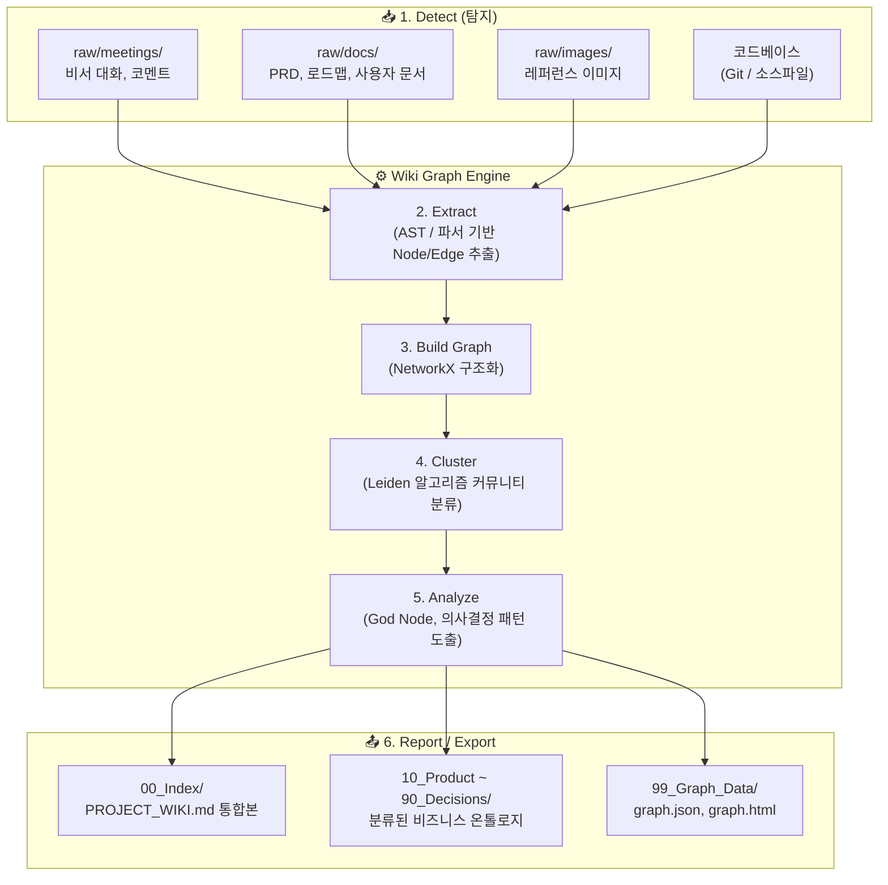
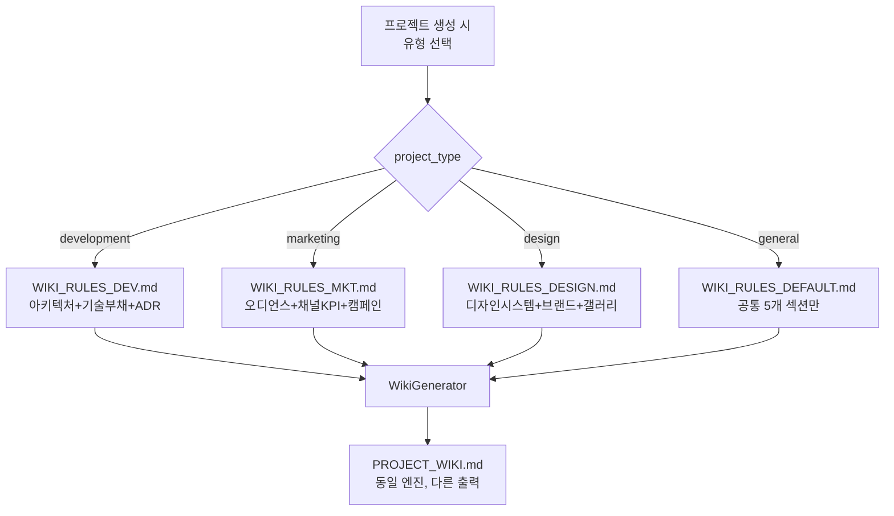

# Phase 41: Project Wiki — 프로젝트 지식 위키 자동 생성 시스템

**작성일**: 2026-05-11
**작성자**: Sonnet (기획·설계) — 대표님 요청
**상태**: 📋 Draft (구조 설계 완료)
**연결 문서**: 
- [Phase40_My_Graph_아키텍처_기획서](Phase40_My_Graph_아키텍처_기획서.md) — My-Graph 코드 추적 시스템
- [Phase39-1_Plan_Master_관련_기획서](Phase39-1_Plan_Master_관련_기획서.md) — Plan Master 기획 파이프라인
**참조**: [Graphify --wiki 모드](https://javaexpert.tistory.com/1718) (카파시의 위키 구현 버전)

---

## 1. 문제 정의

> *"프로젝트마다 기획서, 자료 등이 폴더에 쌓이게 된다."*

MyCrew 사용자가 프로젝트를 운영하면서 자연스럽게 축적되는 산출물들이 있습니다:

| 산출물 유형 | 현재 위치 | 문제점 |
|---|---|---|
| PRD/기획서 (v1.0, v2.0...) | `.mycrew/docs/roadmaps/` | 버전이 쌓이면 "최신이 뭔지" 혼란 |
| 칸반 댓글·코드리뷰 기록 | SQLite DB (comments 테이블) | 검색 불가, 맥락 단절 |
| 에이전트 사고과정 (Thinking) | Activity 탭 로그 | 1회성, 다음 세션에서 소실 |
| My-Graph 의존성 맵 | `graph.json` / `graph.html` | 코드 구조만 있고, "왜 이렇게 설계했는지" 없음 |
| 대표님 피드백·리워크 사유 | 댓글 + broadcastLog | 분산, 비구조화 |
| **사용자 업로드 자료** (이미지, PDF, 참고문서) | **집합점 없음** (DB에 경로만 기록, 물리 파일 분산) | 에이전트가 다음 세션에서 접근 불가, 위키 수집 사각지대 |

**핵심 문제**: AI 에이전트가 다음 세션에서 *"이전에 대표님이 왜 이 기능을 거절했지?"*, *"이 모듈의 설계 의도가 뭐였지?"* 같은 질문에 답하려면 **모든 파일을 다시 읽어야** 합니다. 이것이 바로 Graphify가 풀고자 한 "raw 파일 재탐색" 문제의 **프로젝트 관리(PM) 버전**입니다.

---

## 2. 해결 방안: Project Wiki

Graphify의 `--wiki` 모드에서 영감을 받되, MyCrew의 고유 자산(칸반, Plan Master, My-Graph)을 활용하여 **코드 + 기획 + 의사결정 기록을 하나의 구조화된 위키로 자동 생성**합니다.

### 💡 핵심 철학
```
"AI가 프로젝트를 이해하려면 코드만이 아니라, 
 기획 의도 + 거절 사유 + 변경 이력까지 한눈에 봐야 한다."
```

이것은 Graphify의 "코드 + 문서 + 이미지 → 지식 그래프" 접근을 **코드 + PRD + 칸반 + 리뷰로그 → 지식 위키**로 확장한 것입니다.

---

## 3. 시스템 아키텍처 (Graphify 알고리즘 파이프라인)

LLM 요약기를 배제하고, Graphify의 **6단계 알고리즘 분리 모듈(Detect -> Extract -> Build -> Cluster -> Analyze -> Export)**을 MyCrew 백엔드에 이식합니다.



---

## 4. Wiki 자동 생성 파이프라인 (알고리즘 상세)

### 4.1 Phase 1~2: Detect & Extract (수집 및 추출)
`raw/` 디렉토리에 파일이 추가되거나 칸반 상태가 변경되면 트리거됩니다.
- **스키마 명시 (Schema Constraints)**: 
  - Extractor 모듈은 각 파일에서 `nodes`와 `edges`를 딕셔너리 형태로 추출합니다.
  - 추출된 `edge` 객체는 반드시 **`relation`**(관계 유형)과 **`confidence`**(추론 신뢰도/출처) 속성을 가져야 합니다.
  - 이를 통해 "어디서 나온 관계인지", "문서에서 직접 추출했는지 AI가 추론했는지"를 완벽하게 역추적할 수 있습니다.

### 4.2 Phase 3~4: Build & Cluster (통합 및 클러스터링)
- **Build Graph**: 추출된 딕셔너리(Dict) 형태의 Node/Edge 데이터를 Python `NetworkX`(또는 My-Graph 코어) 자료구조로 병합합니다. 모듈 간 상태 공유는 최소화됩니다.
- **Cluster**: Leiden community detection 등의 알고리즘을 사용하여 서로 연관성이 높은 기능 명세, 미팅 기록, 코드를 커뮤니티 단위로 묶어냅니다.

### 4.3 Phase 5: Analyze (분석 및 메타인지 도출)
- 단순 텍스트 요약이 아닌, 수학적 알고리즘을 통해 아키텍처의 **중심 허브(God Node)**를 판별하고, 겉보기에 무관해 보이는 컴포넌트 간의 **놀라운 연결점(Surprising connections)**을 발견합니다.
- 사용자의 의사결정 패턴을 추출하여 메타인지 분석 데이터를 구성합니다.

### 4.4 Phase 6: Report / Export (내보내기)
- 분석된 그래프 객체를 각 폴더의 목적에 맞게 포맷팅하여 출력(Export)합니다.
- `PROJECT_WIKI.md`, `미팅분석.md`, `graph.json` 등은 모두 **이 수학적 그래프를 다른 도구(또는 에이전트)가 읽기 편하게 변환한 중간 포맷(Intermediate Format)**입니다.
- **증분 업데이트 (Incremental)**: SHA256 해시를 기반으로 `--update` 파라미터를 적용해 변경된 `raw/` 파일에 대해서만 재추출을 수행하여 비용을 최소화합니다.

---

## 5. 에이전트 활용 시나리오 (Graphify 적용 사례)

### 1) 레거시 코드베이스 온보딩
새 팀원(또는 새 에이전트)이 투입되었을 때, 단순 파일 위치가 아니라 "구조와 의사결정 배경"을 파악하는 데 사용됩니다. Call graph, imports, 문서 관계를 하나로 묶어 구조 지도를 만들기 때문에 온보딩이 매우 빠릅니다.
- **가능한 질의 (Graphify Query)**:
  - `/graphify query "authentication flow is connected to which modules?"`
  - `/graphify path "DigestAuth" "Response"`

### 2) 논문 + 코드 + 메모가 섞인 연구 저장소 정리
`raw/` 폴더에 대표님이 논문 URL, 트윗 스냅샷, 메모, 스크린샷 등을 일괄적으로 업로드해 두시면, 파이프라인이 이를 수집(Ingest)하고 그래프를 갱신하여 자료들을 유기적으로 연결합니다.
- **활용 예시**:
  - `/graphify add https://arxiv.org/abs/...`
  - `/graphify query "what connects attention to the optimizer?"`

### 3) 아키텍처 질문에 답하는 AI 보조 도구 (구조 기반 탐색)
에이전트가 파일 시스템 전체를 무작위로 검색(`grep`)하는 대신, Export된 `PROJECT_WIKI.md` 리포트를 선행적으로 읽고 전체적인 구조를 파악합니다.
- **실무 가치**:
  - "어떤 모듈이 사실상 중심 허브(God Node)인가?"
  - "문서상 설계 의도와 실제 코드 연결이 맞는가?"
  - "서로 멀어 보이는 두 컴포넌트 사이의 경로는 무엇인가?"

### 4) 증분 업데이트가 필요한 프로젝트
캐시가 SHA256 기반이므로 `--update` 파라미터를 통해 변경된 파일만 다시 처리합니다. 잦은 변경이 일어나는 MyCrew 프로젝트 환경에서 전체 재분석 비용(토큰)을 획기적으로 줄여줍니다.

### 5) 다른 도구로 내보내는 그래프 파이프라인 (Export)
위키는 단순 시각화 도구가 아니라, 다른 분석 도구로 데이터를 넘기기 위한 '중간 포맷 생성기'입니다.
- **출력 포맷**: `PROJECT_WIKI.md`, `GraphML`, `SVG`, `Neo4j (Cypher)`, `Obsidian vault`, `MCP Server` 리소스 등.

## 6. Graphify와의 차별점 (MyCrew 고유 설계)

| 요소 | 원본 Graphify | MyCrew Project Wiki |
|---|---|---|
| **입력** | 코드 + 문서 + 이미지 | 코드 + PRD + 칸반 + 댓글 + 리뷰로그 + **raw/ 사용자 자료** |
| **그래프 엔진** | tree-sitter AST + NetworkX | My-Graph (순수 Python BFS) + SQLite |
| **클러스터링** | Leiden community detection | 칸반 컬럼 기반 자연 분류 (Todo/Done/Blocked) |
| **관계 태깅** | EXTRACTED / INFERRED / AMBIGUOUS | DECIDED / REJECTED / PENDING |
| **출력물** | graph.html + GRAPH_REPORT.md | PROJECT_WIKI.md + DECISION_LOG.md + wiki.json |
| **트리거** | 수동 CLI / --watch | 칸반 이벤트 기반 자동 + 수동 |
| **외부 의존성** | tree-sitter, NetworkX, Claude API | 없음 (My-Graph + 기존 Ari Engine 내장) |

---

## 7. 파일 구조 설계 및 이중 저장 방지 (Zero-Copy) 원칙

```text
04_Users/01_Company/01_Projects/{project_name}/
├── Project_WIKI/                      ← 🆕 프로젝트 지식 및 메타데이터 통합 폴더
│   ├── 00_Index/                      ← [Export] PROJECT_WIKI.md (전체 지식의 진입점)
│   ├── 10_Product/                    ← [Export] 제품 비전, 타겟 오디언스, 핵심 가치
│   ├── 20_Domain/                     ← [Export] 도메인 모델, 용어 사전 (Glossary)
│   ├── 30_Requirements/               ← [Export] 기능 명세, 요구사항 (PRD 기반 추출)
│   ├── 40_Flows/                      ← [Export] 유저 여정, 상태 다이어그램 등 흐름
│   ├── 50_Business_Rules/             ← [Export] 핵심 비즈니스 로직, 정책, 제약사항
│   ├── 60_Roles_Permissions/          ← [Export] 권한, 역할(RBAC) 정의
│   ├── 70_External_Integrations/      ← [Export] 외부 연동, 서드파티 API 규격
│   ├── 90_Decisions/                  ← [Export] 의사결정 기록 (ADR), 미팅 기반 결정사항
│   ├── 99_Graph_Data/                 ← [Export] graph.json 등 순수 알고리즘 구조 데이터
│   └── raw/                           ← [미가공/원본] 위키 전용 원본 데이터의 단일 유입구
│       └── meetings/                  ← 비서 대화, 코멘트 원본 덤프 (자기 자리가 여기임)
│           └── YYYY-MM-DD_회의록.md
├── 04_IO/                             
│   ├── inputs/                        ← 기존 사용자 업로드 원본 폴더 (이중 복사 금지)
│   └── outputs/
├── .mycrew/docs/roadmaps/             ← PRD 원본 폴더 (이중 복사 금지)
└── src/                               ← 소스 코드 (이중 복사 금지)
```

### 📌 데이터 수집 및 저장 룰 (이중 저장 방지)

#### 1. 로우 폴더에 저장하지 않고 **원본을 그대로 참조(Zero-Copy)**하는 소스
기존 마이크루 시스템에 이미 물리적/논리적 자기 자리가 있는 데이터는 위키 전용 폴더(`Project_WIKI/`)로 절대 복사(Double-save)하지 않습니다. Graphify의 `Detect` 알고리즘이 원본 경로를 직접 탐색합니다.
- **기획서 (PRD)**: `.mycrew/docs/roadmaps/` 원본 스캔
- **코드 의존성**: 루트의 `graph.json` 또는 `src/` 스캔
- **칸반 상태 및 댓글**: `SQLite DB` 직접 쿼리
- **사용자 업로드 참조 파일**: `04_IO/inputs/` 원본 스캔

#### 2. `Project_WIKI/raw/` 하위에 직접 저장해야 하는 폴더 (위키 전용 원본)
위키와 메타인지 생성을 위해서만 새롭게 태어나는 데이터들은 이중 저장 이슈가 없으므로 `Project_WIKI/raw/` 하위에 독립적으로 저장됩니다.
- `raw/meetings/` : (미가공) 대표님과 비서 간의 대화 덤프 (유일한 원본 장소)

#### 3. 넘버링 폴더 (`Project_WIKI/00~99/`)의 정의
넘버링 폴더에는 미가공 데이터를 절대 두지 않습니다. 오직 알고리즘 파이프라인이 `Detect -> Extract -> Cluster`를 거쳐 의미 단위로 도출해 낸(Export) 최종 산출물만 적재됩니다.
- **10_Product**: `raw/meetings/` 및 기획서 초안에서 추출한 제품 비전/타겟 노드
- **20_Domain**: `raw/meetings/` 및 DB 스키마에서 추출한 도메인/용어 사전
- **30_Requirements**: `PRD` 문서 및 칸반 카드에서 추출한 명세/요구사항 노드
- **40_Flows**: 대화 시나리오 및 라우팅 코드에서 추출한 상태 전이 흐름
- **50_Business_Rules**: 백엔드 로직 및 지시사항 코멘트에서 추출한 핵심 제약사항
- **90_Decisions**: 모든 칸반 코멘트의 승인/거절 로그에서 추출한 의사결정(ADR) 노드

---

## 8. 구현 우선순위

| 우선순위 | 항목 | 예상 난이도 |
|---|---|---|
| 🟢 P0 | `raw/` 디렉토리 자동 생성 + 업로드 라우팅 | 하 |
| 🟢 P0 | WikiCollector — 소스 통합 수집 로직 (raw/ 포함) | 하 |
| 🟢 P0 | PROJECT_WIKI.md 템플릿 기반 생성 (8개 섹션) | 하 |
| 🟡 P1 | LLM 요약 생성 (Sonnet 4.6 연동) | 중 |
| 🟡 P1 | DECISION_LOG.md 자동 추적 | 중 |
| 🟡 P1 | 칸반 이벤트 기반 자동 트리거 | 중 |
| 🟡 P1 | raw/images/ Vision 자동 캡션 생성 | 중 |
| 🔵 P2 | 증분 업데이트 (SHA256 캐시) | 상 |
| 🔵 P2 | 에이전트 세션 시작 시 자동 주입 | 중 |
| ⚪ P3 | 대시보드 Wiki 탭 UI | 상 |
| ⚪ P3 | wiki.json 기반 MCP 도구 (`query_wiki`) | 중 |

---

## 9. "항상 그래프를 먼저 보라": 에이전트 세션 강제 주입 방안

Graphify의 `install` 명령어가 CLAUDE.md 등을 세팅하여 AI가 `raw` 폴더를 뒤지기 전에 `GRAPH_REPORT.md`를 무조건 먼저 보게 강제하는 원리를 MyCrew 백엔드에 이식합니다.

### 9.1 시스템 프롬프트 하드 인젝션 (Hard Injection)
에이전트(루카, 소넷 등)가 프로세스를 띄우거나 테스크를 배정받을 때, `executor.js` 내부에서 **Export된 위키 리포트 구조를 System Prompt 최상단에 강제로 주입**합니다.

```javascript
// executor.js — run() 함수 내 "Read Graph First" 로직
const wikiPath = path.resolve(projectDir, 'Project_WIKI/04_wiki/PROJECT_WIKI.md');
const analysisPath = path.resolve(projectDir, 'Project_WIKI/01_meeting_analysis/메타인지_분석.md');

let graphContext = "## 📚 아키텍처 및 메타인지 그래프 리포트\n";
if (fs.existsSync(wikiPath)) graphContext += fs.readFileSync(wikiPath, 'utf-8') + "\n";
if (fs.existsSync(analysisPath)) graphContext += fs.readFileSync(analysisPath, 'utf-8');

systemPrompt = `${graphContext}\n\n${systemPrompt}`;
```

### 9.2 MCP Query 도구 제공 (Graphify Query)
에이전트가 `PROJECT_WIKI.md` 리포트를 읽고 부족한 점이 있다면, 곧바로 `raw` 소스를 여는 것이 아니라 **그래프 엔진에 직접 쿼리를 날릴 수 있는 MCP 도구**를 제공합니다.
- `mcp_mycrew_query_graph`: Graphify의 `/graphify query` 나 `/graphify path` 처럼 아키텍처 컴포넌트 간의 경로, 중심 노드 등을 질문할 수 있는 도구.

## 10. WIKI_RULES 확장성 설계 — 프로젝트 유형별 위키 최적화

참조: [Socian Wiki](socian-wiki-main/) — CLAUDE.md 하나로 개발 기획·비즈니스 질문 모두 대응하는 실증 사례

### 10.1 3-Layer 분리 아키텍처

```
┌─────────────────────────────────────────────┐
│  Layer 1: WikiEngine (불변)                  │
│  - WikiCollector (소스 수집)                  │
│  - WikiIndexer (섹션 분류)                    │
│  - WikiGenerator (LLM 호출)                  │
│  - WikiDiffTracker (증분 갱신)                │
├─────────────────────────────────────────────┤
│  Layer 2: WIKI_RULES_{TYPE}.md (교체 가능)    │  ← 이것만 바꾸면 됨
│  - 섹션 정의 (어떤 섹션을 생성할지)             │
│  - 소스 매핑 (어떤 소스를 어디에 쓸지)           │
│  - 출력 템플릿 (각 섹션의 형식)                 │
│  - 금지 패턴 (이 유형에서 배제할 내용)           │
├─────────────────────────────────────────────┤
│  Layer 3: 프로젝트 데이터 (가변)               │
│  - 칸반 카드, 댓글, PRD, raw/, graph.json     │
└─────────────────────────────────────────────┘
```

**WikiEngine(Layer 1)은 프로젝트 유형을 모릅니다.** WIKI_RULES(Layer 2)가 "이 섹션을 만들어라, 이 소스를 써라"라고 지시하면 그대로 실행합니다.

### 10.2 프로젝트 유형별 WIKI_RULES 분기



### 10.3 유형별 섹션 비교

| 섹션 번호 | 개발 프로젝트 | 마케팅 프로젝트 | 디자인 프로젝트 |
|---|---|---|---|
| **10** | 프로젝트 개요 | 캠페인 개요 | 프로젝트 개요 |
| **20** | 아키텍처 맵 | 채널별 전략 | 디자인 시스템 |
| **30** | 의사결정 기록 (ADR) | 의사결정 기록 (ADR) | 의사결정 기록 (ADR) |
| **40** | 기능별 상태 | 태스크별 상태 | 태스크별 상태 |
| **50** | 기술 부채 | 성과 분석 (KPI) | 브랜드 가이드 |
| **60** | 변경 이력 | 변경 이력 | 변경 이력 |
| **70** | 확장 로드맵 | 다음 캠페인 계획 | 확장 로드맵 |
| **80** | 참조 자료 인벤토리 | 참조 자료 인벤토리 | 레퍼런스 갤러리 |

> **공통 섹션**: 10(개요), 30(ADR), 40(상태), 60(이력), 80(참조자료) — 모든 유형에 존재
> **특화 섹션**: 20, 50, 70 — 프로젝트 유형에 따라 WIKI_RULES가 재정의

### 10.4 WIKI_RULES가 정의하는 4가지

| 항목 | 역할 | 예시 (개발 vs 마케팅) |
|---|---|---|
| **섹션 구조** | 어떤 섹션을 생성할지 | 아키텍처 맵 vs 채널별 KPI |
| **소스 매핑** | 어떤 데이터를 어디에 쓸지 | graph.json 우선 vs raw/ 우선 |
| **출력 템플릿** | 각 섹션의 출력 형식 | ADR 4단 형식, 의존성 맵 vs 채널 성과 테이블 |
| **금지 패턴** | 이 유형에서 배제할 내용 | "마케팅 KPI" 배제 vs "코드 의존성" 배제 |

### 10.5 구현 로드맵

| 단계 | 내용 | 시기 |
|---|---|---|
| **Phase 41** | `WIKI_RULES_DEV.md` 단일 버전으로 개발 위키 완성 | 즉시 |
| **Phase 41.1** | DB `projects` 테이블에 `project_type` 컬럼 추가 | 위키 안정화 후 |
| **Phase 41.2** | `WIKI_RULES_MKT.md`, `WIKI_RULES_DESIGN.md` 추가 | 마케팅 프로젝트 런칭 시 |
| **Phase 41.3** | 프로젝트 생성 모달에 "유형 선택" UI 추가 → 자동 Rules 매핑 | UI 스프린트 |

---

## 11. 요약

> **Project Wiki**는 Graphify의 "파일 모음 → 질의 가능한 지식 그래프" 철학을 
> **프로젝트 관리 영역**으로 확장한 MyCrew 고유 시스템입니다.
> 
> 코드 의존성(My-Graph) + 기획 의도(PRD) + 의사결정 기록(ADR) + 리뷰 이력(Prime)
> \+ **사용자 업로드 원본 자료(raw/)**를 **하나의 구조화된 위키 문서**로 합성하여, 
> AI 에이전트가 세션 시작 시 즉시 프로젝트의 전체 맥락을 파악할 수 있게 합니다.
>
> **확장성**: WikiEngine은 하나, `WIKI_RULES_{TYPE}.md`만 교체하면
> 개발·마케팅·디자인 프로젝트 모두 커버합니다. (Socian Wiki CLAUDE.md 패턴 차용)
>
> "에이전트에게 더 많은 파일을 보여주는 것이 아니라,
>  더 적은 토큰으로 더 깊이 이해하게 만드는 것" — 이것이 Project Wiki의 목표입니다.
