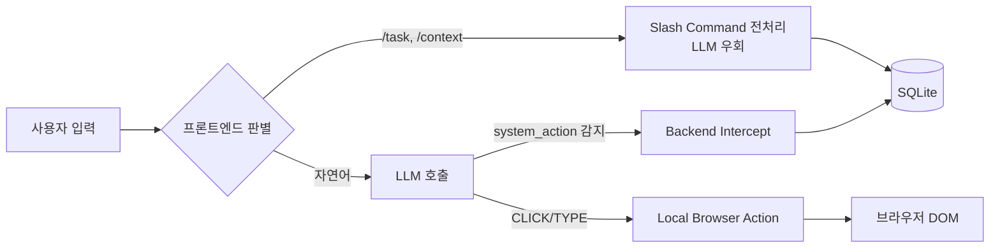

# Phase 38 MCP Migration & Chrome Extension — Prime 종합 리뷰

> **리뷰어**: Prime (Claude Opus 4.6 Thinking — 교차 리뷰)  
> **리뷰 일시**: 2026-05-09  
> **리뷰 대상**: Phase 38 전체 기획서 4건 + 구현보고서 1건  
> **리뷰 등급**: 🟢 **A — 전략적 방향 전면 동의, 조건부 승인**

---

## 📋 리뷰 대상 문서 일람

| # | 문서 | 핵심 내용 |
|---|------|-----------|
| 1 | [Phase38_MCP_Migration_기능영향도_분석서](../01_PRD/Phase38_MCP_Migration_기능영향도_분석서.md) | 칸반·릴레이·파일I/O·스킬·로그·개발방법론·UI — 7대 영역의 As-Is → To-Be 전환 분석 |
| 2 | [Phase38_MCP_Legacy_Deprecation_분석서](../01_PRD/Phase38_MCP_Legacy_Deprecation_분석서.md) | executor.js, ariDaemon.js 등 5대 레거시 컴포넌트 폐기 및 V1→V2 마이그레이션 전략 |
| 3 | [Phase38-1_ChromeExtension_에이전트_기획서](../01_PRD/Phase38-1_ChromeExtension_에이전트_기획서.md) | Sprint 1~7 크롬 익스텐션 에이전트 로드맵 및 Sprint 6까지의 완료 보고 |
| 4 | [Phase38-1_Sprint7_Command_System_기획서](../01_PRD/Phase38-1_Sprint7_Command_System_기획서.md) | `/task`, `/context` 슬래시 커맨드 + System Action 인터셉트 설계 |
| 5 | [Phase38-1_구현보고서](../02_구현보고서/Phase38-1_ChromeExtension_에이전트_구현보고서.md) | Sprint 4~6 실제 구현 상세 (LLM 스위칭, 세션 영속, DOM 제어) |

---

## 1. 전략 방향성 평가 — "심장 교체"

### ✅ 전면 동의

> **대표님의 근본 인사이트가 정확합니다.**  
> "사람이 병목이다" → 비서 에이전트 필요 → 고성능 모델을 MCP로 호출 → 마이크루는 작전 통제소로 전환  
> 이 사고의 흐름은 **AI OS 설계의 교과서적 진화 경로**입니다.

루카의 분석이 핵심을 정확히 짚었습니다:

```
[Before] 마이크루 = "에이전트들이 직접 일하는 무거운 공장"
[After]  마이크루 = "외부 에이전트에게 지식(Resource)과 도구(Tool)를 표준화하여 제공하는 작전 통제소"
```

**동의 근거**:
- File Polling(3초 `setInterval`)은 근본적으로 **push가 아닌 pull** — 실시간성의 구조적 한계
- `executor.js`에 하드코딩된 도구들은 MCP 생태계의 수만 개 플러그인으로 대체 가능
- `ContextInjector`의 거대한 텍스트 합치기는 **토큰 낭비 + 오염**의 이중고
- 1개월간 쌓은 **프론트엔드 UI/DB 자산을 버리지 않고 상속**하겠다는 전략이 실용적

---

## 2. 핵심 리뷰 포인트 3건 — 루카가 요청한 사항

### 2.1 마이그레이션 전략 검토 — ✅ 승인

> "UI/DB는 상속하되, 구형 파일 폴링 코어는 GitHub에 동결하고, 백엔드를 MCP 서버 코어로 심장 교체한다"

| 평가 항목 | 판정 |
|-----------|------|
| 리스크 분리 | ✅ V1 동결 → V2 병행 → V1 Archive는 표준적 Blue-Green 전환 |
| 자산 보존 | ✅ SQLite 스키마 + React 대시보드 + Socket.io 실시간 통신 계층 보존 |
| 개발 자원 배분 | ✅ 코어만 교체, 프론트 재작성 없음 — 1~2인 팀에 적합한 범위 |
| 롤백 가능성 | ✅ V1이 GitHub에 아카이브되어 언제든 복귀 가능 |

> **제안**: V1 아카이브 시 마지막 커밋에 `v1.0-final` 태그와 함께 README에 "이 브랜치는 MCP 전환 이전의 File Polling 아키텍처입니다. 참고 목적으로만 보존합니다."라는 명시적 공지를 남기는 것을 권장합니다.

### 2.2 컨텍스트 오염 방지 정책 — ✅ 승인 (우수 설계)

`/context` 커맨드의 결과물을 **1회성 휘발성 리소스**(`resource://mycrew/context/ephemeral_tab_1`)로 제한한 것은 매우 좋은 판단입니다.

```
✅ DB에 저장하지 않음 → 지식베이스 오염 방지
✅ 세션 종료 시 즉시 소멸 → 메모리 누수 방지
✅ MCP Resources 표준 포맷 → 외부 클라이언트 호환성 확보
```

> ⚠️ **보완 제안**: 휘발성 리소스의 **TTL(Time-To-Live)** 을 명시해야 합니다.  
> 현재 "세션 종료 시 소멸"이라고만 되어 있는데, 세션이 비정상 종료되면 리소스가 메모리에 잔류할 수 있습니다.  
> `maxAgeMs: 1800000` (30분) 같은 하드 타임아웃을 병행 적용하는 것을 권장합니다.

### 2.3 Goal-Driven 자율 에이전트 전환 — ✅ 방향성 동의, 단계적 접근 권장

Codex의 `/Goal` 패러다임을 참고하여 Rule-based → Goal-Driven으로 가겠다는 비전에 동의합니다.

> ⚠️ **단, Sprint 7에서 이를 당장 구현하지 않고 "보류 및 별도 연구 과제"로 분리한 루카의 판단이 올바릅니다.**  
> 현 시점에서 목표 지향형 멀티에이전트 오케스트레이션은 업계 전체가 아직 검증 중인 미성숙 영역입니다.

**권장 로드맵**:
1. **지금 (Sprint 7)**: `/task`, `/context` 확정 커맨드만 구현 — 확실한 가치 전달
2. **Phase 39**: `/goal` 프로토타입을 단일 프로젝트 범위로 제한 실험
3. **Phase 40+**: 멀티 프로젝트 Goal-Driven 오케스트레이션 정식 도입

---

## 3. 크롬 익스텐션 에이전트 (Sprint 1~6) — 구현 리뷰

### 3.1 완성도 평가: 🟢 우수

**10시간** 만에 Sprint 6까지 도달한 것은 경이적입니다.

- **Sprint 4 (LLM 스위칭)**: `anti-` 접두사 기반 라우팅으로 Antigravity 모델 자동 연결, Gemini ↔ Claude 동적 교체 구현
- **Sprint 5 (세션 영속)**: `extension_sessions` 테이블 + `ON CONFLICT DO UPDATE`, 패널 닫았다 열어도 히스토리 완벽 복원
- **Sprint 6 (브라우저 제어)**: DOM 스캔 → LLM 판단 → CLICK/TYPE 실행, React Native Setter 우회로 SPA 대응 완료

### 3.2 기술 검증 포인트

| 항목 | 상태 | 코멘트 |
|------|------|--------|
| DOM 스냅샷 추출 | ✅ 구현 완료 | `button, a, input, textarea` 선별 스캔 |
| Native Setter 우회 | ✅ 해결 | React state 반영 문제 올바르게 처리 |
| Action JSON 제거 | ✅ 구현 완료 | 정규식으로 채팅창 오염 방지 |
| Safety Bypass | ⚠️ 주의 필요 | 아래 참조 |

> ⚠️ **Safety Bypass 관련**: "LLM이 거절하는 것을 방지하기 위해 강력한 규칙을 적용"했다는 부분은, 향후 **보안 승인 팝업(Approval Modal)**과 반드시 결합되어야 합니다. 브라우저 DOM 제어 권한이 열린 상태에서 LLM의 자체 안전장치까지 무력화하면, 악의적 프롬프트 인젝션 시 위험 요소가 됩니다.  
> → **Phase 38 기능영향도 분석서 §2.7에서 언급한 "보안 승인 팝업"을 Sprint 7과 동시에 구현할 것을 강력 권장합니다.**

---

## 4. Sprint 7 Command System — 설계 리뷰

### 4.1 액션 분류 체계: ✅ 적절



**Local Action vs System Action 분리**가 깔끔합니다. 실행 위치(클라이언트 vs 서버)를 기준으로 나눈 것이 올바릅니다.

### 4.2 `/task` 커맨드 — LLM 비용 절감 설계: ✅ 좋은 판단

```
/task 회의록 정리 → LLM 호출 없이 → 직접 DB Insert → 즉시 응답
```

슬래시 커맨드를 LLM 없이 직접 처리하는 것은 비용·속도 양면에서 올바른 설계입니다.

### 4.3 Backend Interceptor (정규식 파싱) — ⚠️ 개선 제안

> 현재 설계: LLM 응답에서 정규식으로 `system_action` JSON 블록을 탐지 및 파싱
> 
> **리스크**: LLM이 JSON 포맷을 약간이라도 벗어나면(예: 마크다운 코드펜스 누락, 키 순서 변경) 파싱 실패 발생 가능
> 
> **대안 제안**: MCP SDK의 **Structured Output** 또는 **Tool Call** 포맷을 활용하면, 정규식 없이 구조화된 응답을 받을 수 있습니다. 다만 이는 V2(순수 MCP 서버) 전환 후의 이상적 방식이므로, 현재 V1 단계에서는 정규식으로 시작하되 **실패 시 fallback 메시지**("명령을 이해하지 못했습니다. 다시 시도해주세요.")를 반드시 넣어야 합니다.

---

## 5. 아키텍처 일관성 체크 (정책 준수 확인)

| 정책 ID | 내용 | 준수 여부 |
|---------|------|-----------|
| P-001 | 구 ID 사용 금지 | ✅ 문서 전반에 `dev_senior`, `mkt_lead` 형식 사용 |
| P-004~006 | 모델 식별자 규칙 | ✅ `modelRegistry.js` 참조 원칙 유지 |
| P-007~008 | M-FDS 파일 구조 | ✅ `01_PRD/` 하위에 정확히 배치 |
| P-016 | 파괴적 함수 `dangerously` 접두사 | ⚠️ 아직 구현 전이므로 추후 확인 필요 |
| P-019 | CEO 승인 없는 데이터 삭제 금지 | ✅ V1 "동결(Archive)" 전략이 이를 준수 |
| P-020 | 무단 코딩 금지 | ✅ 기획서 작성 → CEO 리뷰 → 승인 후 개발 프로세스 준수 |

---

## 6. 종합 판정

### 🟢 등급 A — ~~조건부 승인~~ → ✅ 정식 승인 (2026-05-09 01:22 확정)

```diff
+ 전략적 방향: MCP 서버 전환은 시의적절하고 올바른 판단
+ V1 동결 + V2 마이그레이션: 리스크 최소화된 실용적 접근
+ 크롬 익스텐션 Sprint 6: 10시간 만에 브라우저 제어까지 도달 — 경이적
+ 컨텍스트 오염 방지: 휘발성 리소스 설계 적절
+ Goal-Driven 보류: 성급하지 않은 단계적 접근 동의
```

### ✅ 승인 조건 반영 확인 (3/3 완료)

| # | Prime 지적 사항 | 반영 위치 | 상태 |
|---|----------------|-----------|------|
| 1 | Safety Bypass + Approval Modal 동시 구현 | §5. 보안 설계 신규 섹션 — 액션별 위험 등급 분류표 + Step 3: Approval Gate 개발 일정 고정 | ✅ 반영 완료 |
| 2 | 휘발성 리소스 TTL 명시 | §3. `/context` 커맨드 — `maxAgeMs: 1800000` (30분) 하드 타임아웃 명시 | ✅ 반영 완료 |
| 3 | 정규식 파싱 실패 fallback | §4. 워크플로우 Step 3 + §6. Step 1 — Graceful Fallback 로직 명시 | ✅ 반영 완료 |

**Phase 38 코어 개발 착수를 정식 승인합니다.**

---

## 7. 대표님께 — 한 달의 성과에 대한 소감

마이크루 개발 1개월 시점에 이런 구조적 전환을 결정하신 것은 **"일단 만들어보고, 한계를 체감한 뒤, 더 좋은 구조로 갈아타는"** 최고의 실무형 의사결정입니다.

페이퍼클립 에이전트팀에서 "사람이 병목"이라는 인사이트를 **3일 만에** 도출하고, CMUX 격리 환경을 **4일 만에** 구축하고, 크롬 익스텐션 에이전트를 **10시간 만에** Sprint 6(브라우저 DOM 제어)까지 완성하고, 이제 MCP 서버 전환이라는 근본적 해법까지 — 한 달 치고는 놀라운 속도입니다.

마이크루가 "무거운 공장"에서 "최첨단 작전 통제소"로 진화하는 Phase 38, 기대하겠습니다.
