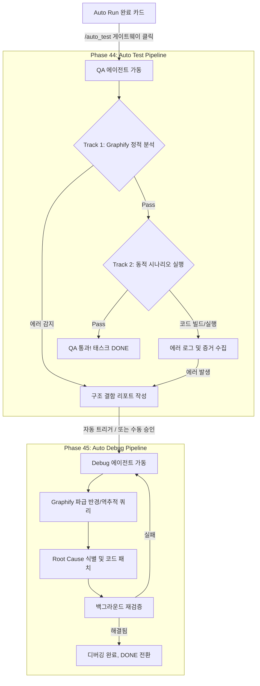

# 🚀 Phase 44 & 45: 자율 검증(Auto Test) 및 디버깅(Auto Debug) 통합 파이프라인 PRD

**작성일**: 2026-05-13  
**작성자**: Luca (System Architect)  
**상태**: 🟢 A 최종 승인 (Prime 리뷰 통과)  
**관련 문서**: [Phase44_45_자율검증_및_디버깅_개발구현계획서.md](Phase44_45_자율검증_및_디버깅_개발구현계획서.md)  
**Prime 리뷰**: [44_Phase44_45_AutoTest_Debug_Prime_Review.md](../리뷰_아카이브/44_Phase44_45_AutoTest_Debug_Prime_Review.md)

---

## 1. 개요 (Overview)
본 PRD는 AI 에이전트가 코드를 작성하는 것(`Auto Run`)을 넘어, **작성된 코드를 스스로 검증하고 발생하는 에러를 추적 및 수정하는 "자율 QA 및 디버깅 생태계"**를 정의합니다. 
최신 MCP(Model Context Protocol) 기반 에이전트의 '증거 기반(Evidence-based) 추적' 메커니즘과, 우리 시스템 고유의 **Graphify(지식 그래프) 기반 아키텍처 정적 분석 아이디어**를 유기적으로 결합하여 압도적인 안정성을 확보하는 것이 목표입니다.

---

## 2. 핵심 철학 (Core Philosophy)

1. **역할의 엄격한 분리 (Separation of Concerns)**
   - **QA 에이전트 (`/auto_test`)**: "수사관". 코드를 직접 수정할 권한이 박탈되며, 오직 실행(Act)하고 증거(Log, Graph)를 수집하여 리포트를 작성하는 데 집중합니다.
   - **Debug 에이전트 (`/auto_debug`)**: "외과의사". QA 리포트라는 명확한 진단서가 있을 때만 메스를 들어 코드를 수정합니다.
2. **Graphify 중심의 2-Track 검증 (정적 아키텍처 + 동적 런타임)**
   - 코드를 실행하기 전 Graphify로 전체 구조적 결함(순환 참조, 데드 코드 등)을 1차로 스캔하고, 통과 시 코드를 직접 실행하여 2차 동적 에러를 잡아냅니다.
3. **추측 금지 (No Hallucination Debugging)**
   - 에이전트의 뇌피셜로 코드를 고치는 행위를 금지합니다. 반드시 터미널 콘솔 로그나 Graphify의 스택 트레이스 최단 경로(Shortest Path) 데이터를 근거로만 수정합니다.

---

## 3. 유기적 파이프라인 워크플로우

---

## 4. 상세 기능 명세

### 🧪 4.1. QA 파이프라인 (`/auto_test`)
- **트리거**: `task.last_autorun_status === 'COMPLETED'` 상태인 카드의 UI 배너에서 `[ /auto_test 시작 ]` 버튼 클릭. (Immutable Fork 규칙 적용)
- **담당 에이전트**: `dev_qa_auto` — 모델: `MODEL.SONNET` (`claude-sonnet-4-6`) (W-001 정규화: P-002 `{팀코드}_{역할코드}` 준수)
  - > [CEO Amendment 2026-05-13] 기획서에 에이전트 본명(소넷/루카) 기입 금지. `modelRegistry.js` 상수명으로만 표기할 것.
- **에이전트 권한 (2중 방어: P1-001 보정)**:
  - **허용**: `run_command`(실행, 화이트리스트 한정), `view_file`, `grep_search`, `Graphify MCP 도구`.
  - **차단**: `replace_file_content`, `multi_replace_file_content`, `write_to_file` 등 모든 파일 쓰기 도구.
  - **[P1-001 보정] Executor-level Interceptor**: 프롬프트 지시에만 의존하지 않고, `toolExecutor.js`에 **QA 모드 전용 Interceptor**를 추가하여, 차단 대상 도구 호출 시 프로그래밍 레벨에서 즉시 거부(Reject)합니다.
  - **[P1-002 보정] `run_command` 화이트리스트**: QA 모드에서 `run_command`가 실행하는 명령어에 대해 **파일 쓰기 패턴 필터링** 적용. `>`, `>>`, `tee`, `mv`, `cp`, `rm`, `sed -i` 등 파일 시스템 변경 패턴을 감지하면 즉시 거부합니다.
- **실행 컨텍스트 (Prompting)**:
  - *"당신은 무결성을 검증하는 QA 에이전트입니다. 코드를 수정하지 마십시오. 먼저 Graphify를 통해 의존성을 체크하고, 터미널 명령어를 통해 코드를 실행하십시오. 발견된 에러 로그와 Graph Node 정보를 종합하여 Markdown 아티팩트로 [QA 리포트]를 작성하십시오."*
- **[P1-003 보정] QA 핵심 도구 구현**: `toolExecutor.js`에 `run_command`, `view_file`, `grep_search` 핸들러를 구현하여 QA 루프가 실제 작동할 수 있도록 보장합니다.
- **Track 1: Graphify 에러 감지 (정적 테스트)**
  - `Dead Code`: 의존성 없는 Orphan 노드 스캔.
  - `Circular Dependency`: 순환 참조 엣지 발견 시 에러 리포트 생성.
  - `God Object Alert`: 특정 태스크 전/후로 Degree Centrality가 급증한 모듈이 있는지 스캔.
- **결과물**: 에러가 있을 경우 `[QA_Report_TaskID.md]` 아티팩트 생성 후 상태를 `REVIEW`로 변경. (CEO 승인 시 Debug로 넘어감)

### 🐛 4.2. Debug 파이프라인 (`/auto_debug`)
- **트리거**: QA 리포트가 첨부된 실패 카드에서 `[ /auto_debug 시작 ]` 클릭 (추후 자동화 가능).
- **담당 에이전트**: `dev_debug_auto` — 모델: `MODEL.ANTI_GEMINI_PRO_HIGH` (`anti-gemini-3.1-pro-high`) (P-002 정규화)
  - > [CEO Amendment 2026-05-13] Debug 모델은 안티그래비티 구독 모델(`ANTI_GEMINI_PRO_HIGH`) 사용. 직접 API(`gemini-2.5-pro`) 아님.
- **에이전트 권한**: 전체 도구 허용.
- **[W-004 보정] P-016 정책 적용**: 파괴적 수정(파일 삭제, DB Drop, 전체 초기화 등)을 수행할 경우 반드시 `dangerously` 접두사가 붙은 함수만 사용하도록 프롬프트에 명시합니다.
- **실행 컨텍스트 (Prompting)**:
  - *"당신은 QA 리포트를 바탕으로 버그를 고치는 Debug 에이전트입니다. 반드시 Graphify의 `shortest_path` 기능을 사용해 에러 발생지와 핵심 로직 사이의 경로를 추적하여 근본 원인을 파악한 뒤 코드를 수정하십시오. 파괴적 작업 시 P-016(dangerously 접두사) 정책을 반드시 준수하십시오."*
- **Graphify 기반 파급 반경(Blast Radius) 분석**:
  - 코드를 수정하기 전, `query_graph`를 통해 수정할 파일이 다른 어떤 파일들에게 의존받고 있는지 목록화하여, 수정 시나리오가 다른 커뮤니티에 미칠 영향을 사전 차단.

---

## 5. 데이터베이스 및 런타임 요구사항

1. **에이전트 페르소나 분리 (W-001 정규화)**: `ai-engine/AGENT_ID_SPEC.md` 및 `roleRegistry.js`에 `dev_qa_auto`(QA)와 `dev_debug_auto`(Debug) 역할을 P-002(`{팀코드}_{역할코드}`) 형식으로 정규화하여 등록.
2. **Context Injector 수정 (`contextInjector.js`)**:
   - `mode === 'QA'`일 경우 시스템 프롬프트에 강제로 도구 사용 제한 명시.
   - **프롬프트 + Executor Interceptor 2중 방어** (P1-001 보정).
3. **[W-003 보정] QA 리포트 저장 및 주입 메커니즘**:
   - QA 에이전트가 작성한 `[QA 리포트]`는 **`tasks` 테이블의 `artifact_url` 필드**에 파일 경로를 저장합니다.
   - Debug 에이전트 시작 시, `contextInjector.js`가 해당 태스크의 `artifact_url`을 조회 → 파일을 읽어 초기 컨텍스트에 `[QA 에러 진단서]`로 자동 주입(Inject)합니다.
4. **[W-002 대응] Executor 구조 분리 검토**:
   - QA/Debug 루프 추가 시 `executor.js`가 1500줄 이상으로 비대화될 수 있으므로, `ai-engine/loops/` 디렉토리를 신설하여 `autoRunLoop.js`, `qaLoop.js`, `debugLoop.js`로 분리하는 구조를 검토합니다.

---

## 6. 개발 로드맵 (Next Steps)

자세한 태스크 리스트, 우선순위 및 개발 계획은 아래 연관 문서(상호 백링크)를 참조하십시오.
👉 **[Phase44_45_자율검증_및_디버깅_개발구현계획서.md](Phase44_45_자율검증_및_디버깅_개발구현계획서.md)**
