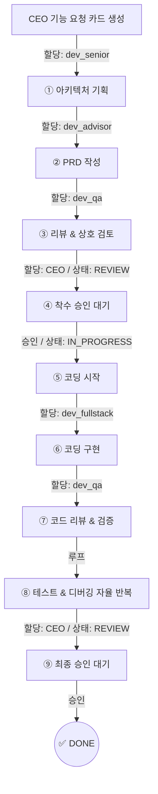

# MyCrew 개발팀 운영 및 콘텐츠 기획서 (PRD)
> **Phase 35 | 대상: 프로젝트별 에이전트 워크플로우 · 스킬 라이브러리 · 팀원 프로필 콘텐츠**
> 이 문서는 MyCrew 개발팀(dev_*)과 글로벌 비서(assistant) 간의 명확한 역할 분담, 워크플로우 파이프라인, 사용할 태스크 템플릿, 도구 권한, 그리고 스킬 레지스트리를 정의하는 핵심 운용 지침서입니다.

---

## 1. 전제 — 개발팀 에이전트 정체성 (Agent Identity)

개발팀 에이전트는 **코드(Code) · 아키텍처(Architecture) · 문서(Document)**를 주요 산출물로 생산합니다. 
구버전의 개인화된 닉네임(luca, sonnet 등) 대신 **역할 기반의 표준 ID 체계(`dev_*`)**를 엄격히 준수하여 다중 프로젝트(Multi-Tenant) 환경에서의 컨텍스트 오염을 방지합니다.

> [!IMPORTANT]
> **assistant(ARI)는 전담 개발팀에서 제외합니다.**
> assistant는 특정 프로젝트나 코드 생산에 귀속되지 않으며, 전체 프로젝트를 넘나드는 **글로벌 통합 비서(PM 및 조율자)** 역할로 한정합니다. 실무 개발은 전담 `dev_*` 에이전트 체제로 운영합니다.

### 1.1 현재 활성 개발팀 에이전트 프로필

| agentId | 표시명 (Role 첫 절) | 전담 핵심 영역 | 지정 모델 |
|:---|:---|:---|:---|
| **`dev_fullstack`** | Fullstack Engineer | 프론트/백엔드 실제 코딩, 컴포넌트 개발 | **anti-gemini-3.1-pro-high** |
| **`dev_ux`** | UI/UX Designer | 디자인 시스템, 사용자 경험 기획, 퍼블리싱 | **anti-gemini-3.1-pro-high** |
| **`dev_senior`** | Senior Engineer | 아키텍처 설계, DB 스키마, API 설계, 리뷰 | **anti-claude-sonnet-4.6-thinking** |
| **`dev_backend`** | Backend Engineer | 서버 로직, 데이터베이스 쿼리, 인프라 연동 | **anti-claude-sonnet-4.6-thinking** |
| **`dev_qa`** | QA Engineer | 코드/보안 심층 검증, 테스트 코드 작성, 무결성 검수 | **anti-claude-opus-4.6-thinking** |
| **`dev_advisor`** | Tech Advisor | 기술 검토, 시스템 문서화(PRD), 아키텍처 자문 | **anti-claude-opus-4.6-thinking** |

> **설계 원칙**: 개발팀 모델은 역할의 특성에 맞추어 **Gemini 3.1 Pro / Claude Sonnet 4.6 / Claude Opus 4.6** 등 적합한 엔진을 할당받아 수행합니다.

---

## 2. 자율 협업 워크플로우 파이프라인 4종 (Workflow Pipelines)

각 파이프라인은 칸반 보드의 `상태(Status)`와 `담당자(Assignee)` 변경을 통한 **자율 Handoff(인계)**를 기반으로 작동합니다.

### WF-01 | 신규 기능 개발 파이프라인 (CEO 승인 게이트 2단계 포함)
이 파이프라인은 기획부터 배포까지의 풀 사이클을 정의하며, 중대한 리소스가 투입되므로 CEO의 명시적 승인이 필수입니다.



*   **CEO 개입 포인트**:
    *   **④ 착수 승인**: 설계도와 PRD를 검토한 후 실제 코드 생산 착수를 허가합니다.
    *   **⑨ 최종 승인**: 최종 구현된 결과물을 확인하고 배포(Done)를 결정합니다.
*   **자율 실행 구간**: ⑥ ~ ⑧ 단계는 에이전트 간 핑퐁(Ping-pong) 루프로 작동하며, 무결성이 확보될 때까지 CEO의 개입 없이 진행됩니다.

### WF-02 | 버그 수정 파이프라인 (Hotfix)
*   **트리거**: 태스크 카테고리가 `BUG_FIX`로 생성될 때 (Bugdog 자동 리포트 또는 CEO 직접 생성)
*   **프로세스**: `[버그 리포트 생성] → dev_backend/dev_fullstack (재현·진단·코드 수정) → dev_advisor (관련 문서 및 CHANGELOG 반영) → CEO (최종 QA 및 승인)`
*   **산출물**: 수정된 코드 커밋, 디버깅 리포트 문서 업데이트.

### WF-03 | 아키텍처 기획 파이프라인
*   **트리거**: 태스크 카테고리가 `ARCHITECTURE`일 때.
*   **프로세스**: `[설계 요청] → dev_senior (시스템 초안 설계 및 다이어그램) → dev_advisor (명세서 정서 및 요구사항 매핑) → CEO (설계 승인)`
*   **산출물**: 아키텍처 문서, ERD / DB 스키마, 구현 가이드라인.

### WF-04 | 코드 리뷰 파이프라인 (Quality Assurance)
*   **트리거**: 코딩을 마친 카드의 상태가 `REVIEW`로 전환되며 코멘트로 리뷰가 요청될 때.
*   **프로세스**: `[구현 완료] → dev_advisor (PRD 명세 대조 및 기능 검증) → dev_qa (코드 품질 및 보안 최종 확인) → CEO (승인)`
*   **산출물**: 리뷰 코멘트 목록, 리팩토링된 코드, CHANGELOG 업데이트.

---

## 3. 태스크 템플릿 6종 (Task Templates)

태스크 생성 모달에서 `category` 선택 시 자동으로 본문에 로드되는 표준 마크다운 구조입니다. 각 에이전트는 이 템플릿의 체크리스트를 기반으로 업무 완료 여부를 스스로 판별합니다.

### TPL-01 | 기능 개발 (FEATURE_DEV)
```markdown
## 🎯 목표
> 이 기능이 해결하고자 하는 문제와 핵심 가치를 한 줄로 작성합니다.

## 📋 구현 범위
- [ ] 시스템/백엔드 API 설계 (담당: dev_senior)
- [ ] 프론트엔드 연동 가이드 (담당: dev_fullstack)
- [ ] 사용자 문서 및 PRD 업데이트 (담당: dev_advisor)

## ✅ 완료 조건 (DoD)
- 요구사항에 명시된 모든 정상 흐름(Happy Path) 동작 확인
- 예외 상황(Edge Cases) 에러 핸들링 구현 완비
- 관련 문서(API, 로직 설명) 업데이트 완료
```

### TPL-02 | 버그 수정 (BUG_FIX)
```markdown
## 🐛 버그 증상
> 무엇이, 언제, 어떻게 잘못 작동하는지 구체적으로 기술합니다.

## 🔄 재현 방법 (Steps to Reproduce)
1. 
2. 

## 🔍 예상 원인 (가설)
- 

## 🎯 수정 목표
> 어떤 상태로 복구되어야 이 카드가 완료되는지 정의합니다.

## 🌐 영향 범위 (Impact)
- 관련 파일: 
- 사용자 체감 영향: 
```

### TPL-03 | 아키텍처 설계 (ARCHITECTURE)
```markdown
## 🏗 배경 (Background)
> 왜 이 아키텍처 설계/변경이 필요한가?

## 📊 핵심 요구사항
- 기능적 요구사항 (Functional): 
- 성능/확장성 (Performance): 
- 보안성 (Security): 

## 🚧 제약 조건 (Constraints)
- 

## 📦 산출물 기대치
- [ ] 시스템 컨텍스트 다이어그램 / ERD
- [ ] API 게이트웨이 및 명세
- [ ] 단계별 구현 가이드
```

### TPL-04 | 코드 리뷰 (CODE_REVIEW)
```markdown
## 🔎 코드 리뷰 항목 (dev_qa 주도)
- [ ] 아키텍처 및 디자인 패턴 원칙 준수 여부
- [ ] DB 쿼리 최적화 (N+1 문제 등 병목 탐지)
- [ ] 에러 핸들링 및 예외 처리 완전성
- [ ] 보안 취약점 점검 (Injection, XSS 등)
- [ ] 코드 중복 최소화 (DRY 원칙 준수)

## ⚡ 성능 및 규격
- [ ] 핵심 API 응답 시간 < 200ms 보장 여부

## 📝 문서화 검증 (dev_advisor 주도)
- [ ] API 명세서 최신화 반영 여부
- [ ] CHANGELOG 및 릴리즈 노트 작성
```

### TPL-05 | PRD 작성 (PRD)
```markdown
# PRD: [기능 명칭]

## 1. 개요 (Overview)
> 제품이나 기능의 목적과 배경을 요약합니다.

## 2. 사용자 스토리 (User Stories)
- **As a** [사용자 역할], **I want to** [원하는 행동], **so that** [얻고자 하는 목적/가치].

## 3. 기능 명세 (Functional Specifications)
| 기능명 | 설명 및 제약조건 | 우선순위(MoSCoW) |
|:---|:---|:---|
| | | |

## 4. API 명세 초안 (Draft)
| Method | Endpoint | 설명 및 파라미터 |
|:---|:---|:---|
| | | |

## 5. 미결정 사항 (Open Questions)
- 
```

### TPL-06 | 스프린트 회고 (RETRO)
```markdown
## ✅ 성공적으로 완료된 항목 (What went well)
- 

## 🔴 아쉬웠거나 미완료된 항목 (What didn't go well)
- 

## 💡 배운 점 및 인사이트 (Learnings)
- 

## 🚀 다음 스프린트 개선 액션 아이템 (Action Items)
- 
```

---

## 4. 도구 권한 매트릭스 (Tool Permission Matrix)

보안과 역할의 전문성을 위해 에이전트별로 사용할 수 있는 도구(Tool)를 제한합니다.

| 도구 (Tool) | assistant | dev_senior | dev_fullstack | dev_qa | dev_advisor | 권한 레벨 및 설명 |
|:---|:---:|:---:|:---:|:---:|:---:|:---|
| `file:read` | ✅ | ✅ | ✅ | ✅ | ✅ | **CORE**: 워크스페이스 내 모든 파일 컨텍스트 열람 허용. |
| `file:write` | ✅ | ✅ | ✅ | ❌ | ✅ | **CORE**: 코드 작성(dev_fullstack, dev_senior), 문서 작성(dev_advisor). dev_qa는 리뷰 전문. |
| `file:move` | ✅ | ❌ | ❌ | ❌ | ✅ | **DOC**: 프로젝트 파일 구조 정리 및 아카이빙 목적. |
| `file:delete` | ✅ | ❌ | ❌ | ❌ | ❌ | **EXEC**: 파일 영구 삭제. (위험도가 높아 assistant만 전담) |
| `code:execute` | ✅ | ❌ | ❌ | ❌ | ❌ | **EXEC**: 로컬 터미널 스크립트 실행. (보안 샌드박스로 assistant 전담) |
| `web:search` | ✅ | ✅ | ✅ | ✅ | ✅ | **CORE**: 최신 레퍼런스, 라이브러리 공식 문서 검색. |
| `db:read` | ✅ | ✅ | ✅ | ✅ | ✅ | **CORE**: 현재 칸반 태스크 및 로그 조회. |
| `db:write` | ✅ | ✅ | ✅ | ✅ | ❌ | **ARCH/DEV**: 칸반 태스크 메타데이터 수정 및 DB 직접 조작. |
| `kanban:create` | ✅ | ❌ | ❌ | ❌ | ✅ | **DOC/PM**: 기획 기반의 신규 태스크 카드 파생 생성. |
| `kanban:update` | ✅ | ❌ | ✅ | ❌ | ✅ | **DOC/PM**: 태스크 상태 및 메타데이터 동기화 관리. |

---

## 5. 스킬 레지스트리 확장 (개발팀 전용 7종)

`skillRegistry.js` 에 등록되어 에이전트의 시스템 프롬프트를 동적으로 변경하는 스킬셋입니다.

| ID | Layer | 전담 에이전트 | 스킬 이름 | 아이콘 (`material-symbols`) | 스킬 상세 정의 (프롬프트 주입 규칙) |
|:---|:---:|:---|:---|:---|:---|
| `code-architect` | 0 | dev_senior | Code Architect | `architecture` | 시스템 설계 전담. SOLID 원칙 철저 준수. DB 정규화(3NF) 및 확장성 우선의 시스템 구조 다이어그램 도출. |
| `tech-researcher`| 0 | assistant | Tech Researcher | `biotech` | 최신 기술 스택 리서치 전담. 공식 문서를 최우선 레퍼런스로 활용하며, 최소 3개 이상의 대안을 비교 분석. |
| `prd-writer` | 0 | dev_advisor | PRD Writer | `description` | PRD 작성 전담. 모호한 요구사항은 독단적으로 추론하지 않고 반드시 역질문하여 명확화함. 버전 관리 명시. |
| `code-review` | 1 | dev_qa | Code Review | `rate_review` | 코드 품질 검수 전담. OWASP Top 10 보안 점검, N+1 쿼리 등 성능 병목 탐지, 중복 코드 리팩토링 제안 필수. |
| `devops-basic` | 1 | assistant, dev_senior | DevOps Basic | `terminal` | 인프라 기본 관리. 서버 프로세스 및 로그 확인. CRITICAL 작업 전 반드시 CEO 승인 요청 및 롤백 플랜 확보 필수. |
| `api-design` | 2 | dev_senior, dev_advisor | API Design | `api` | RESTful 설계 전담. 일관된 응답 포맷(status, data, error 구조) 강제. 에러 코드 체계화 표준 적용. |
| `sprint-pm` | 4 | assistant | Sprint PM | `sprint` | 1주일 단위 스프린트 관리. 에이전트별 태스크 적절성 판단 및 할당. 블로커 발생 시 즉각 CEO에게 브리핑 리포트 발송. |

---

## 6. 에이전트별 성과 지표 (KPI Metrics)

단순한 완료 개수(resolvedCount)를 넘어, `category` 데이터를 조합하여 에이전트별 전문성에 맞는 세분화된 KPI를 Dashboard(Performance 탭)에 시각화합니다.

| 대상 에이전트 | 핵심 KPI 1 | 핵심 KPI 2 |
|:---|:---|:---|
| **assistant** | Tasks Resolved (일반 완료 건수) | Bugs Fixed (버그 수정 참여도) |
| **dev_senior** | Core Arch Docs (핵심 아키텍처 설계) | Refactoring Done (리팩토링 기여도) |
| **dev_fullstack** | Code Deployed (배포된 코드/기능) | UI/UX Tasks Done (디자인/프론트 구현) |
| **dev_qa** | Code/Arch Reviews Done (설계 및 코드 리뷰) | Bugs Blocked (사전 차단한 버그) |
| **dev_advisor** | Docs & PRDs Created (기획 및 문서 생성) | QA Passed (검증 통과 건수) |

---

## 7. 구현 우선순위 및 로드맵 (Roadmap)

| 순위 | 우선도 | 구현 대상 | 세부 작업 내용 | 예상 소요 공수 |
|:---|:---:|:---|:---|:---|
| **1** | 🔴 P0 | 멀티 테넌트 마이그레이션 | 신규 `dev_*` 기반 에이전트 ID 전환 및 프로젝트 격리 아키텍처 완성. | 완료 |
| **2** | 🔴 P0 | 스킬 레지스트리 탑재 | `skillRegistry.js` 파일에 개발팀 전용 7종 스킬 데이터 스키마 병합. | 완료 |
| **3** | 🟡 P1 | 템플릿 로더 연동 | `TaskDetailModal`에서 category 선택 시 위 6종 마크다운 템플릿을 본문에 자동 삽입하는 UI 이벤트 구현. | 2시간 |
| **4** | 🟡 P1 | 대시보드 KPI 세분화 | 에이전트 Detail View에 category 기반의 KPI 게이지 및 수치 분리 렌더링. | 1시간 |
| **5** | 🟢 P2 | 워크플로우 시각화 | Performance 탭 내부에 현재 프로젝트의 워크플로우 파이프라인 진척도 노출. | 3시간 |
| **6** | 🟢 P2 | Tool 권한 매트릭스 UI | 관리자 패널(Tools & Permissions)에서 권한 상태 시각화. | 2시간 |

---

## 8. CEO 의사결정 필요 항목 (Decision Points)

다음은 Phase 35 완료를 위해 최종 결정이 필요한 정책 안건입니다.

1. **에이전트 닉네임 부여 시점 결정** (🟡 미확정)
   - **A안**: 대표님께서 수동으로 언제든 지정 (현재 방식)
   - **B안**: 게이미피케이션 방식. "특정 태스크 N개 달성 시 시스템이 알림을 띄우며 자동 닉네임 제안 및 수여"
2. **Task 카테고리 속성 변경 시 기존 데이터 마이그레이션 정책** (🟡 미확정)
   - **A안**: 하위 호환성 유지. (과거 완료된 `QUICK_CHAT` 태스크는 그대로 유지하고 새 태스크부터 적용)
   - **B안**: 강제 마이그레이션. (기존 완료 카드들을 추론하여 `BUG_FIX`, `FEATURE_DEV` 등으로 맵핑 배치 작업 수행)
3. **DEV 스킬 프리셋 자동 활성화 여부** (✅ **확정**)
   - `strict_isolation` 모드로 생성된 개발 타겟 프로젝트의 팀원으로 에이전트가 채용될 경우, 위 7종의 DEV 스킬 프리셋을 **자동 장착**하여 초기 컨텍스트 오염을 방지하고 개발 몰입도를 높입니다.
4. **Performance KPI 집계 기준(Scope)** (🟡 미확정)
   - **A안**: 선택된 프로젝트(현재 스코프) 기준의 성과만 렌더링.
   - **B안**: 에이전트의 전체 누적 생애 성과와 프로젝트별 성과를 스플릿 뷰(Split View)로 병행 표시.
